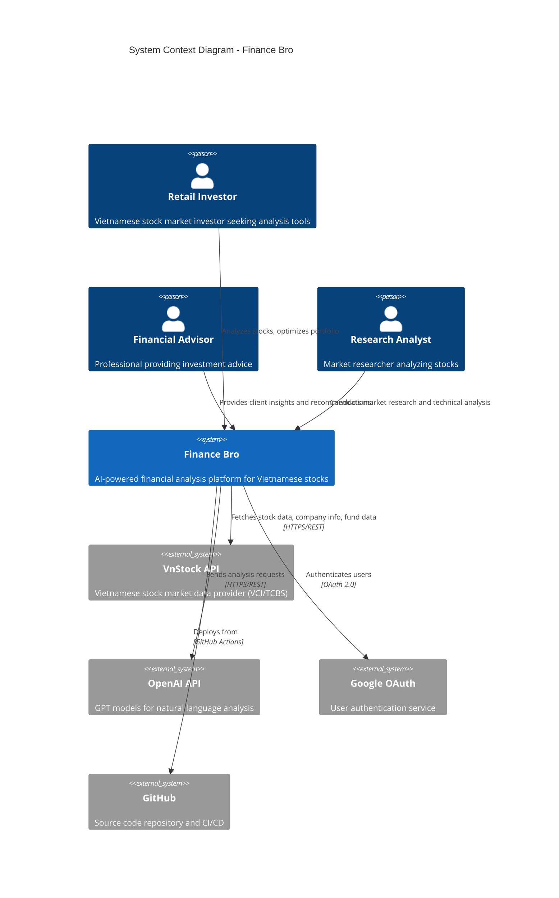

# System Context

## Overview

Finance Bro is an AI-powered financial analysis platform designed specifically for the Vietnamese stock market. It provides comprehensive analysis tools, portfolio optimization, and real-time insights through an intuitive Streamlit web interface.

## System Purpose

**Mission**: Democratize financial analysis for Vietnamese retail investors by providing professional-grade tools powered by AI and real-time market data.

**Target Users**:
- Individual investors analyzing Vietnamese stocks
- Financial advisors seeking comprehensive market insights
- Portfolio managers optimizing investment strategies
- Research analysts requiring technical and fundamental analysis

## System Context Diagram

## External Dependencies

### Data Sources

#### VnStock API (Primary)
- **Purpose**: Vietnamese stock market data provider
- **Data Types**: 
  - Real-time and historical price data
  - Company fundamentals and financial statements
  - Investment fund NAV and allocations
  - Technical indicators and market statistics
- **Sources**: VCI (primary), TCBS (secondary)
- **Integration**: REST API with local caching
- **Reliability**: High (99%+ uptime)

#### OpenAI API
- **Purpose**: Natural language processing and AI analysis
- **Models Used**: GPT-4o-mini (default)
- **Use Cases**:
  - Natural language queries about financial data
  - Automated report generation
  - Chart analysis and insights
  - Investment recommendations
- **Rate Limits**: Standard OpenAI API limits
- **Fallback**: Graceful degradation without AI features

### Authentication & Security

#### Google OAuth 2.0
- **Purpose**: User authentication and authorization
- **Implementation**: Streamlit native OAuth integration
- **User Data**: Email, profile information (minimal)
- **Session Management**: Streamlit session state
- **Security**: Industry-standard OAuth 2.0 flow

### Development & Deployment

#### GitHub
- **Purpose**: Source code management and CI/CD
- **Features Used**:
  - Version control and collaboration
  - GitHub Actions for automated testing
  - Container registry for Docker images
  - Issue tracking and project management

## System Boundaries

### What Finance Bro Does
- ✅ Provides AI-powered analysis of Vietnamese stocks
- ✅ Generates interactive charts and technical analysis
- ✅ Optimizes portfolios using Modern Portfolio Theory
- ✅ Screens stocks based on financial metrics
- ✅ Analyzes Vietnamese investment funds
- ✅ Provides company overview and ownership structure
- ✅ Generates comprehensive financial health reports using multi-agent AI

### What Finance Bro Does NOT Do
- ❌ Execute trades or connect to brokerage accounts
- ❌ Provide real-time trading signals or alerts
- ❌ Store sensitive financial or personal data
- ❌ Offer licensed financial advice
- ❌ Support markets outside Vietnam
- ❌ Guarantee investment returns or performance

## Business Context

### Value Proposition
1. **Accessibility**: Professional-grade analysis tools accessible to retail investors
2. **Localization**: Specifically designed for Vietnamese market characteristics
3. **AI Integration**: Natural language interface for complex financial analysis
4. **Comprehensive Coverage**: Multiple analysis approaches in one platform
5. **Cost Efficiency**: Open-source alternative to expensive financial platforms

### Success Metrics
- **User Engagement**: Active users analyzing stocks regularly
- **Analysis Quality**: Accurate insights leading to informed decisions
- **Market Coverage**: Comprehensive coverage of Vietnamese listed companies
- **Performance**: Fast, responsive analysis across all tools
- **Reliability**: High uptime and consistent data availability

## Constraints and Assumptions

### Technical Constraints
- **Python Version**: Fixed at 3.10.11 for dependency compatibility
- **Dependency Locking**: PandasAI 2.3.0, Pandas 1.5.3, QuantStats 0.0.59
- **Memory Limits**: Streamlit session state limitations
- **API Rate Limits**: OpenAI and VnStock API quotas

### Business Constraints
- **Market Scope**: Vietnamese stock market only
- **Regulatory Compliance**: No financial advice or trading execution
- **Data Licensing**: Dependent on VnStock API terms of service
- **User Authentication**: Requires Google account

### Assumptions
- **Internet Connectivity**: Users have stable internet connection
- **Browser Compatibility**: Modern browsers with JavaScript enabled
- **API Availability**: External APIs maintain high availability
- **User Capability**: Basic understanding of financial concepts
- **Market Data Quality**: VnStock provides accurate, timely data

## Risk Assessment

### High Risk
- **API Dependency**: VnStock or OpenAI service disruptions
- **Data Quality**: Inaccurate data leading to poor analysis
- **Regulatory Changes**: Vietnamese financial data regulations

### Medium Risk
- **Version Conflicts**: Dependency compatibility issues
- **Performance**: Scalability limitations with user growth
- **Security**: Authentication or data protection vulnerabilities

### Low Risk
- **UI Changes**: Streamlit framework updates
- **Feature Requests**: User demand for additional functionality
- **Competition**: Similar platforms entering the market