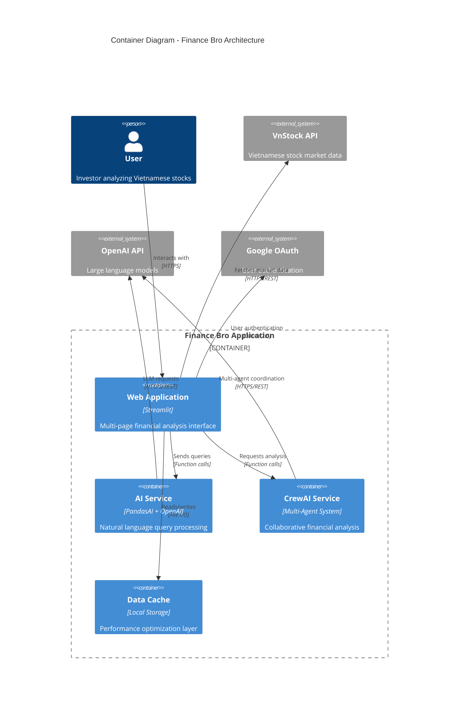
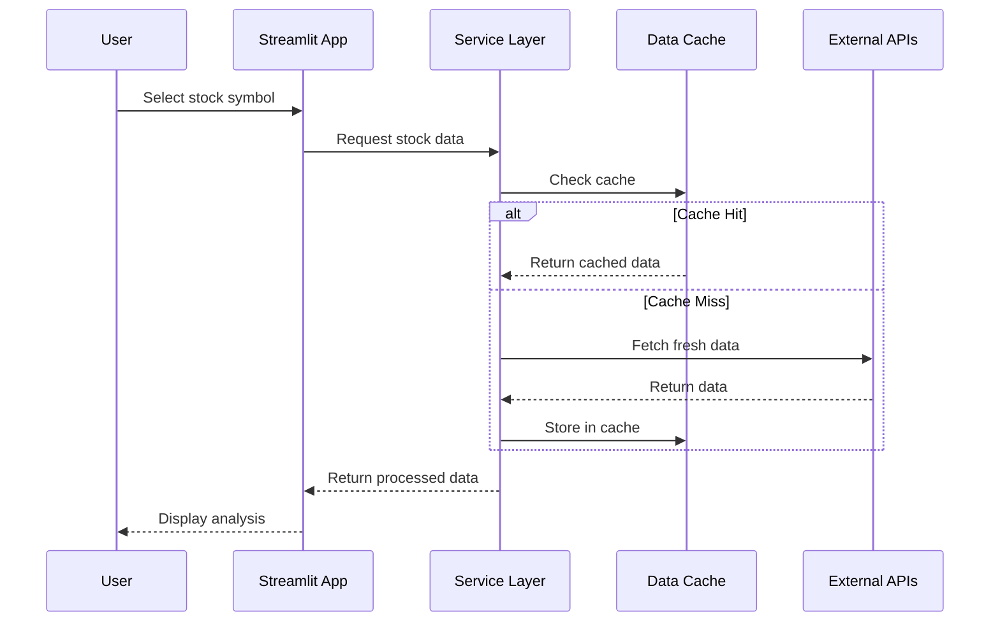
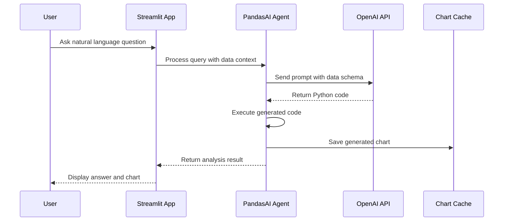

# Architecture Overview

## Architectural Style

Finance Bro follows a **Modular Monolith** architecture pattern with **Microservices-Ready** design principles. The system is structured as a single deployable unit with clear internal boundaries that could be extracted into separate services if needed.

## Core Design Principles

### 1. Separation of Concerns
- **Pages**: Handle user interaction and presentation logic
- **Services**: Encapsulate business logic and external integrations
- **Components**: Provide reusable UI elements
- **Core**: Manage configuration and shared utilities

### 2. Single Responsibility
- Each module has a focused, well-defined purpose
- Services are organized by domain (charts, data, APIs)
- Components are atomic and composable
- Clear boundaries between layers

### 3. Smart Data Loading
- **Progressive Loading**: Data loads in stages with user feedback
- **Dependency Resolution**: Automatic loading of prerequisite data
- **Cache Management**: Intelligent cache invalidation and reuse
- **Error Handling**: Graceful degradation with informative error messages

### 4. Dependency Inversion
- High-level modules don't depend on low-level modules
- Pages depend on services, not external APIs directly
- Configuration drives behavior, not hard-coded values
- Injectable dependencies for testing

### 5. Function-First Design
- Prioritizes functions over classes for simplicity
- Stateless operations where possible
- Pure functions for data transformations
- Explicit state management through Streamlit session

## High-Level Architecture



## Architectural Layers

### Presentation Layer
**Location**: `pages/`, `app.py`
**Responsibility**: User interface and interaction handling

```
📁 Presentation Layer
├── app.py                    # Main entry point and navigation
├── pages/
│   ├── bro.py               # AI chat interface  
│   ├── Stock_Price_Analysis.py
│   ├── Technical_Analysis.py
│   ├── Company_Overview.py
│   ├── Portfolio_Optimization.py
│   ├── Screener.py
│   ├── Fund_Analysis.py
│   └── Financial_Health_Report.py
└── src/components/          # Reusable UI components
    ├── stock_selector.py
    ├── date_picker.py
    └── ui_components.py
```

### Service Layer
**Location**: `src/services/`
**Responsibility**: Business logic and external integrations

```
📁 Service Layer
├── vnstock_api.py          # Market data integration (30+ functions)
├── chart_service.py        # Visualization generation (10+ functions)
├── data_service.py         # Data transformation utilities
├── fibonacci_service.py    # Technical analysis calculations
├── crewai_service.py       # Multi-agent AI coordination
├── session_state_service.py # Smart session state management
└── financial_data_service.py # Centralized financial data loading
```

### Core Layer
**Location**: `src/core/`, `src/utils/`
**Responsibility**: Configuration and shared utilities

```
📁 Core Layer
├── core/
│   └── config.py           # Centralized configuration
└── utils/
    ├── session_utils.py    # Session state management
    └── validation.py       # Data validation utilities
```

### Domain Layer
**Location**: `src/financial_health_crew/`
**Responsibility**: Domain-specific business logic

```
📁 Domain Layer (CrewAI)
├── crew.py                 # Multi-agent coordination
├── main.py                 # Entry point for financial health analysis
├── config/
│   ├── agents.yaml         # Agent definitions and roles
│   └── tasks.yaml          # Task definitions and workflows
└── tools/
    └── financial_analysis_tool.py  # Domain-specific tools
```

## Data Flow Architecture

### Request Processing Flow



### AI Query Processing Flow



## Architectural Patterns

### 1. Repository Pattern
- **Implementation**: Service layer functions act as repositories
- **Benefits**: Abstraction over data sources, consistent interfaces
- **Example**: `get_stock_data()` abstracts VnStock API complexity

### 2. Caching Strategy
- **Layer**: Streamlit `@st.cache_data` decorators
- **Scope**: Function-level caching with TTL
- **Benefits**: Performance optimization, reduced API calls

### 3. Smart Data Loading
- **Pattern**: Progressive data loading with intelligent dependency resolution
- **Implementation**: `src/services/session_state_service.py` and `src/services/financial_data_service.py`
- **Benefits**: Eliminates page dependencies, improves user experience with progress feedback, reduces redundant API calls

### 4. Session State Management
- **Pattern**: Centralized session state in `src/utils/session_utils.py`
- **Scope**: Cross-page data persistence
- **Benefits**: Consistent user experience, data sharing

### 5. Component-Based UI
- **Pattern**: Reusable UI components in `src/components/`
- **Benefits**: Consistency, maintainability, testability
- **Example**: `stock_selector.py` provides consistent symbol selection

### 6. Configuration-Driven Behavior
- **Pattern**: Centralized configuration in `src/core/config.py`
- **Benefits**: Easy environment management, consistent defaults
- **Example**: Cache TTL, default symbols, API endpoints

## Technology Stack

### Frontend
- **Streamlit 1.47.0**: Web framework and UI components
- **Altair**: Interactive statistical visualizations
- **Custom CSS**: Earth-toned theme configuration

### Backend Services
- **PandasAI 2.3.0**: Natural language data analysis
- **CrewAI**: Multi-agent AI collaboration framework
- **Pandas 1.5.3**: Data manipulation and analysis
- **SciPy**: Scientific computing for technical analysis

### External Integrations
- **VnStock 3.2.5**: Vietnamese stock market data
- **OpenAI API**: Large language models (GPT-4o-mini)
- **Google OAuth**: User authentication

### Development & Deployment
- **Python 3.10.11**: Runtime environment
- **UV**: Dependency management
- **Docker**: Containerization
- **GitHub Actions**: CI/CD pipeline

## Quality Attributes

### Performance
- **Data Caching**: Reduces API calls and improves response times
- **Lazy Loading**: Components loaded on demand
- **Chart Export**: Generated charts cached for reuse

### Scalability
- **Modular Design**: Services can be extracted to microservices
- **Stateless Services**: Easy to horizontally scale
- **External State**: Session state managed by Streamlit

### Maintainability
- **Clear Separation**: Well-defined layer boundaries
- **Function-First**: Simple, testable code patterns
- **Documentation**: Comprehensive inline and architectural documentation

### Reliability
- **Error Handling**: Graceful degradation on API failures
- **Fallback Strategies**: Default data when external services fail
- **Input Validation**: Data validation at service boundaries

### Security
- **OAuth Integration**: Standard authentication flows
- **No Data Persistence**: Minimal user data storage
- **API Key Management**: Secure credential handling

## Evolution Strategy

### Current State (v0.2.20+)
- Modular monolith with clear service boundaries
- Comprehensive feature set for Vietnamese market analysis
- Stable dependency management and deployment

### Near-term Evolution
- Enhanced caching strategies for better performance
- Extended AI capabilities with additional models
- Improved error handling and user feedback
- Smart data loading with progressive feedback (v0.2.22+)
- Enhanced valuation flow with pre-loading system (v0.2.22+)

### Long-term Vision
- Microservices extraction for high-load components
- Real-time data streaming capabilities
- Advanced portfolio management features
- Mobile-responsive progressive web app

## Architectural Trade-offs

### Monolith vs. Microservices
- **Chosen**: Modular monolith
- **Rationale**: Simpler deployment, shared data access, faster development
- **Trade-off**: Potential scaling limitations vs. operational complexity

### Function-First vs. Object-Oriented
- **Chosen**: Function-first approach
- **Rationale**: Simplicity, testability, Streamlit compatibility
- **Trade-off**: Less encapsulation vs. reduced complexity

### Local Caching vs. External Cache
- **Chosen**: Local file-based caching
- **Rationale**: Simplicity, no additional infrastructure
- **Trade-off**: Single-instance limitation vs. operational overhead