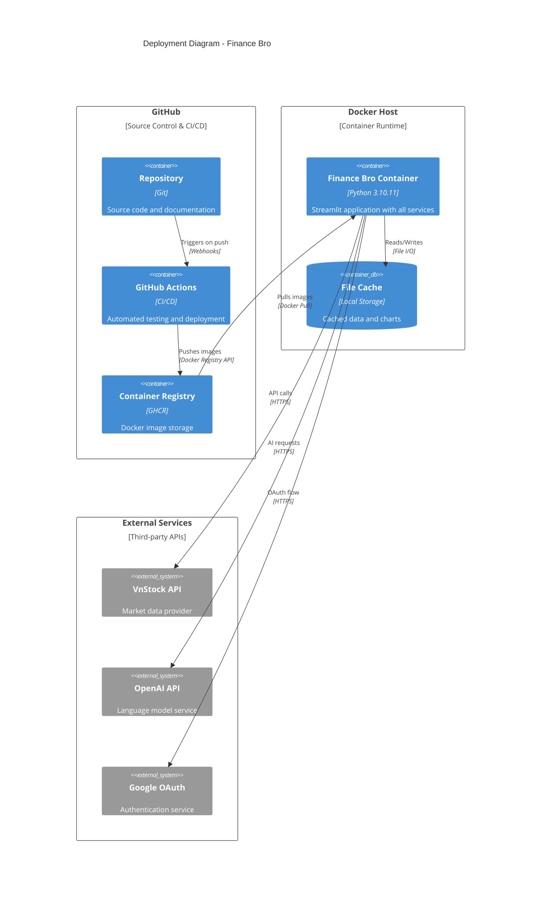
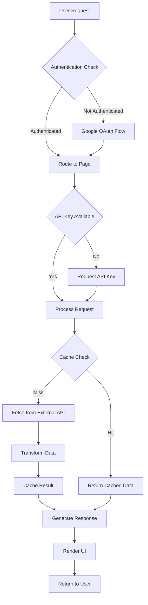
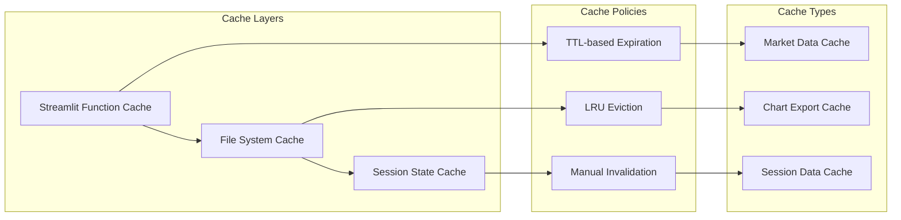

# Container Architecture

## Container Overview

Finance Bro is deployed as a single container application with clear internal service boundaries. This section details the container structure, deployment patterns, and internal service architecture.

## Deployment Architecture



## Container Composition

### Main Application Container

**Image**: `ghcr.io/gahoccode/finance-bro:latest`
**Base**: `python:3.10.11-slim`
**Architecture**: Multi-platform (linux/amd64, linux/arm64)

#### Container Structure
```dockerfile
# Runtime Dependencies
FROM python:3.10.11-slim

# System dependencies
RUN apt-get update && apt-get install -y \
    build-essential \
    curl \
    software-properties-common \
    && rm -rf /var/lib/apt/lists/*

# Application code
WORKDIR /app
COPY . .

# Python dependencies (using uv for speed)
RUN pip install uv && uv sync --frozen

# Runtime configuration
EXPOSE 8501
HEALTHCHECK CMD curl --fail http://localhost:8501/_stcore/health
CMD ["uv", "run", "streamlit", "run", "app.py", "--server.port=8501"]
```

#### Environment Variables
```bash
# Required
OPENAI_API_KEY=sk-...                    # OpenAI API access

# Optional Runtime Configuration  
STREAMLIT_SERVER_PORT=8501               # Server port (default: 8501)
STREAMLIT_SERVER_ADDRESS=0.0.0.0        # Bind address (default: 0.0.0.0)
STREAMLIT_BROWSER_GATHER_USAGE_STATS=false  # Disable telemetry

# Optional Authentication (production)
GOOGLE_CLIENT_ID=...                     # Google OAuth client ID
GOOGLE_CLIENT_SECRET=...                 # Google OAuth client secret
GOOGLE_REDIRECT_URI=...                  # OAuth redirect URI
```

#### Volume Mounts
```yaml
volumes:
  - ./cache:/app/cache                   # Data cache persistence
  - ./exports:/app/exports               # Chart and report exports
  - ./logs:/app/logs                     # Application logs (optional)
```

## Internal Service Architecture

### Service Boundaries

```mermaid
C4Component
    title Component Diagram - Internal Services

    Container_Boundary(webapp, "Web Application Container") {
        Component(streamlit_app, "Streamlit App", "Python", "Main application framework")
        Component(auth, "Authentication Service", "OAuth", "User authentication and session management")

        ComponentDb(session_store, "Session Store", "Memory", "User session state")
        ComponentDb(cache_service, "Cache Service", "File System", "Data caching layer")

        Component(page_router, "Page Router", "Streamlit Navigation", "Multi-page application routing")

        Boundary(business_services, "Business Services") {
            Component(vnstock_service, "Market Data Service", "VnStock Integration", "Stock market data access")
            Component(ai_service, "AI Analysis Service", "PandasAI", "Natural language query processing")
            Component(crew_service, "Multi-Agent Service", "CrewAI", "Collaborative AI analysis")
            Component(chart_service, "Chart Service", "Visualization", "Chart generation and export")
            Component(portfolio_service, "Portfolio Service", "Optimization", "Portfolio analysis and optimization")
        }
        
        Boundary(ui_components, "UI Components") {
            Component(stock_selector, "Stock Selector", "Component", "Symbol selection interface")
            Component(date_picker, "Date Picker", "Component", "Date range selection")
            Component(chart_display, "Chart Display", "Component", "Chart rendering and interaction")
        }
    }

    System_Ext(vnstock_api, "VnStock API", "External market data")
    System_Ext(openai_api, "OpenAI API", "External AI service")

    Rel(streamlit_app, auth, "Authenticates users")
    Rel(streamlit_app, page_router, "Routes requests")
    Rel(page_router, business_services, "Delegates business logic")
    
    Rel(vnstock_service, vnstock_api, "Fetches data", "HTTPS")
    Rel(ai_service, openai_api, "Processes queries", "HTTPS")
    Rel(crew_service, openai_api, "Coordinates agents", "HTTPS")
    
    Rel(business_services, cache_service, "Caches data")
    Rel(auth, session_store, "Manages sessions")
    
    Rel(page_router, ui_components, "Renders components")
    Rel(ui_components, business_services, "Requests data")
```

### Service Characteristics

#### Market Data Service (`vnstock_service`)
- **Purpose**: Vietnamese stock market data integration
- **API**: 30+ functions for comprehensive market data access
- **Caching**: TTL-based caching with configurable timeouts
- **Error Handling**: Graceful fallback to cached data
- **Rate Limiting**: Respects VnStock API limits

```python
# Key Functions
get_stock_data(symbol, start_date, end_date)    # Historical prices
get_company_overview(symbol)                     # Company fundamentals  
get_fund_data(fund_code)                        # Investment fund data
get_technical_indicators(symbol, indicator)     # Technical analysis
```

#### AI Analysis Service (`ai_service`)
- **Purpose**: Natural language financial analysis
- **Engine**: PandasAI 2.3.0 with OpenAI GPT-4o-mini
- **Context**: Financial data passed as pandas DataFrames
- **Output**: Generated insights, charts, and Python code
- **Caching**: Chart outputs cached to exports directory

```python
# Core AI Workflow
agent = create_pandas_ai_agent(dataframe, config)
response = agent.chat(user_query)
chart_path = agent.last_chart_path
```

#### Multi-Agent Service (`crew_service`)
- **Purpose**: Collaborative AI analysis using multiple specialized agents
- **Framework**: CrewAI for agent coordination
- **Agents**: Financial Analyst, Data Analyst, Report Writer
- **Tasks**: Research, Analysis, Report Generation
- **Output**: Comprehensive financial health reports

```python
# CrewAI Workflow
crew = FinancialAnalysisCrew()
result = crew.run(stock_symbol=symbol, analysis_type="health")
```

#### Chart Service (`chart_service`)
- **Purpose**: Financial data visualization
- **Libraries**: Altair, mplfinance, matplotlib
- **Types**: Line charts, candlestick charts, technical overlays
- **Export**: PNG/SVG export with consistent theming
- **Features**: Interactive charts, Fibonacci retracements

```python
# Chart Generation
chart = create_technical_chart(data, indicators=["SMA", "RSI"])
export_chart(chart, "exports/charts/temp_chart.png")
```

## Data Flow Patterns

### Request Processing Pipeline



### Cache Management Strategy



## Scaling Considerations

### Vertical Scaling
- **CPU**: Moderate requirements for data processing and AI inference
- **Memory**: 2-4GB recommended for multiple concurrent users
- **Storage**: 1-2GB for cache and chart exports
- **Network**: Bandwidth dependent on chart generation and API calls

### Horizontal Scaling Challenges
- **Session State**: Streamlit session state tied to server instance
- **File Cache**: Local file system cache not shared across instances
- **Chart Storage**: Local chart export storage

### Scaling Solutions
```yaml
# Load Balancer Configuration (Future)
version: '3.8'
services:
  nginx:
    image: nginx:alpine
    ports:
      - "80:80"
    volumes:
      - ./nginx.conf:/etc/nginx/nginx.conf
    depends_on:
      - finance-bro-1
      - finance-bro-2

  finance-bro-1:
    image: ghcr.io/gahoccode/finance-bro:latest
    environment:
      - INSTANCE_ID=1
    volumes:
      - shared-cache:/app/cache
      - shared-exports:/app/exports

  finance-bro-2:
    image: ghcr.io/gahoccode/finance-bro:latest
    environment:
      - INSTANCE_ID=2
    volumes:
      - shared-cache:/app/cache
      - shared-exports:/app/exports

volumes:
  shared-cache:
  shared-exports:
```

## Health Monitoring

### Health Check Endpoints
- **Streamlit Health**: `/_stcore/health`
- **Application Health**: Custom health check in `app.py`
- **Service Dependencies**: VnStock API and OpenAI API availability

### Monitoring Metrics
```python
# Key Performance Indicators
{
    "response_times": {
        "page_load": "< 2 seconds",
        "ai_query": "< 10 seconds", 
        "chart_generation": "< 5 seconds"
    },
    "error_rates": {
        "api_failures": "< 5%",
        "authentication_errors": "< 1%",
        "cache_misses": "acceptable"
    },
    "resource_usage": {
        "cpu_utilization": "< 80%",
        "memory_usage": "< 4GB",
        "disk_space": "< 2GB"
    }
}
```

### Logging Strategy
```python
# Structured Logging Configuration
LOGGING_CONFIG = {
    "version": 1,
    "formatters": {
        "structured": {
            "format": "%(asctime)s - %(name)s - %(levelname)s - %(message)s"
        }
    },
    "handlers": {
        "file": {
            "class": "logging.FileHandler",
            "filename": "/app/logs/finance-bro.log",
            "formatter": "structured"
        },
        "console": {
            "class": "logging.StreamHandler",
            "formatter": "structured"
        }
    },
    "loggers": {
        "finance_bro": {
            "level": "INFO",
            "handlers": ["file", "console"]
        }
    }
}
```

## Deployment Patterns

### Development Deployment
```bash
# Local development with hot reload
uv run streamlit run app.py

# Docker development with volume mounts
docker run -p 8501:8501 \
  -v $(pwd):/app \
  -e OPENAI_API_KEY=$OPENAI_API_KEY \
  finance-bro:dev
```

### Production Deployment
```bash
# Docker Compose production deployment
docker-compose up -d

# Direct Docker deployment
docker run -d \
  --name finance-bro \
  -p 8501:8501 \
  -e OPENAI_API_KEY=$OPENAI_API_KEY \
  -v finance-bro-cache:/app/cache \
  -v finance-bro-exports:/app/exports \
  --restart unless-stopped \
  ghcr.io/gahoccode/finance-bro:latest
```

### CI/CD Pipeline
```yaml
# GitHub Actions workflow
name: Build and Deploy
on:
  push:
    branches: [main]

jobs:
  build:
    runs-on: ubuntu-latest
    steps:
      - uses: actions/checkout@v4
      - name: Build Docker image
        run: docker build -t finance-bro .
      - name: Run tests
        run: docker run --rm finance-bro uv run pytest
      - name: Push to registry
        run: |
          docker tag finance-bro ghcr.io/gahoccode/finance-bro:latest
          docker push ghcr.io/gahoccode/finance-bro:latest
```