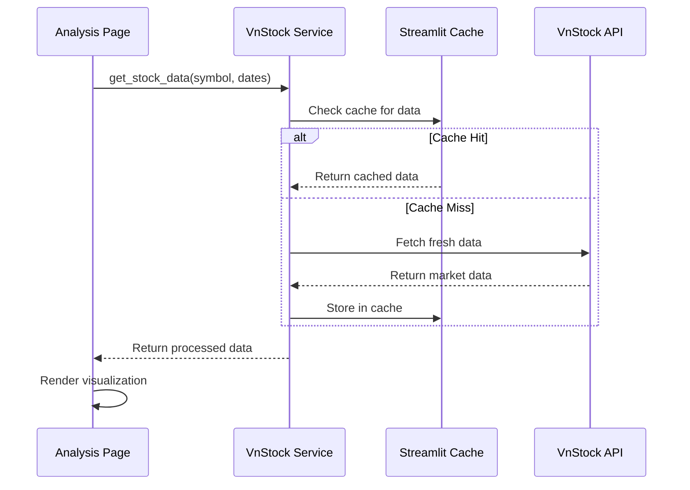
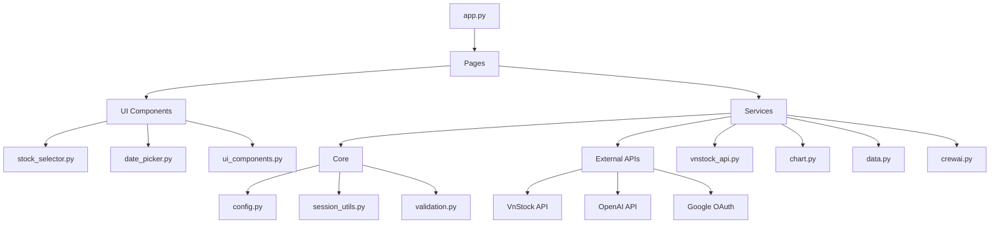

# Component Architecture

## Component Overview

Finance Bro follows a modular component architecture with clear separation between presentation, business logic, and data access layers. This section details the internal component structure, relationships, and design patterns.

## Component Hierarchy

```mermaid
C4Component
    title Component Diagram - Finance Bro Internal Structure

    Container_Boundary(app, "Finance Bro Application") {
        Component(app_main, "App Main", "Streamlit", "Application entry point and navigation")
        
        Boundary(presentation, "Presentation Layer") {
            Component(page_bro, "AI Analysis Page", "Page", "Natural language financial analysis")
            Component(page_price, "Price Analysis Page", "Page", "Interactive price charts and technical analysis")
            Component(page_technical, "Technical Analysis Page", "Page", "Advanced technical indicators and signals")
            Component(page_company, "Company Overview Page", "Page", "Company profile and ownership analysis")
            Component(page_screener, "Stock Screener Page", "Page", "Stock filtering and screening")
            Component(page_fund, "Fund Analysis Page", "Page", "Investment fund analysis")
            Component(page_health, "Financial Health Page", "Page", "Multi-agent financial health analysis")
        }
        
        Boundary(ui_components, "UI Components") {
            Component(stock_selector, "Stock Selector", "Component", "Searchable stock symbol selection")
            Component(date_picker, "Date Picker", "Component", "Date range selection interface")
            Component(ui_styling, "UI Styling", "Component", "Custom CSS and theme management")
        }
        
        Boundary(services, "Service Layer") {
            Component(vnstock_service, "VnStock Service", "Service", "Market data integration and caching")
            Component(chart_service, "Chart Service", "Service", "Visualization generation and export")
            Component(data_service, "Data Service", "Service", "Data transformation and validation")
            Component(fibonacci_service, "Fibonacci Service", "Service", "Technical analysis calculations")
            Component(crewai_service, "CrewAI Service", "Service", "Multi-agent AI coordination")
        }
        
        Boundary(core, "Core Layer") {
            Component(config, "Configuration", "Core", "Centralized application configuration")
            Component(session_utils, "Session Utils", "Utility", "Session state management")
            Component(validation, "Validation", "Utility", "Data validation and sanitization")
        }
        
        Boundary(domain, "Domain Layer") {
            Component(crew_main, "Financial Health Crew", "Domain", "Multi-agent financial analysis orchestration")
            Component(agents_config, "Agent Configuration", "Config", "AI agent definitions and roles")
            Component(tasks_config, "Task Configuration", "Config", "Analysis task definitions")
            Component(financial_tools, "Financial Analysis Tools", "Tools", "Domain-specific analysis tools")
        }
    }

    System_Ext(vnstock_api, "VnStock API", "Vietnamese stock market data")
    System_Ext(openai_api, "OpenAI API", "Large language models")
    System_Ext(google_oauth, "Google OAuth", "User authentication")

    Rel(app_main, presentation, "Routes to pages")
    Rel(presentation, ui_components, "Uses components")
    Rel(presentation, services, "Calls services")
    Rel(services, core, "Uses configuration")
    Rel(page_health, domain, "Orchestrates analysis")
    
    Rel(vnstock_service, vnstock_api, "Fetches data", "HTTPS")
    Rel(crewai_service, openai_api, "AI coordination", "HTTPS")
    Rel(app_main, google_oauth, "Authentication", "OAuth 2.0")
```

## Layer Details

### 1. Application Entry Point

#### App Main (`app.py`)
**Purpose**: Application bootstrap, authentication, and navigation setup

```python
# Key Responsibilities
- Page configuration and theme setup
- Google OAuth authentication flow
- OpenAI API key management
- Multi-page navigation setup
- Session state initialization
- Global error handling
```

**Component Structure**:
```python
def main_page():
    """Main Finance Bro page - serves as the hub for stock symbol selection"""
    # Stock symbol selection with searchable dropdown
    # Quick navigation to analysis pages
    # User instructions and app information
    
# Multi-page navigation configuration
pages = {
    "Home": [st.Page(main_page, title="📈 Finance Bro", icon="🏠")],
    "Analysis": [
        st.Page("pages/bro.py", title="Stock Analysis", icon="📊"),
        # ... other pages
    ]
}
```

### 2. Presentation Layer

#### Page Components
Each page follows a consistent structure pattern:

```python
# Standard Page Structure Template
import streamlit as st
from src.services.vnstock_api import get_stock_data
from src.services.chart import create_technical_chart
from src.components.stock_selector import render_stock_selector
from src.components.ui_components import inject_custom_success_styling

# Page configuration
st.set_page_config(page_title="Page Name", layout="wide")
inject_custom_success_styling()

# Authentication and API key checks
if not st.user.is_logged_in or not st.session_state.api_key:
    st.error("Authentication required")
    st.stop()

# Main page logic
def main():
    st.title("📊 Page Title")
    
    # Stock selection (shared across pages)
    symbol = render_stock_selector()
    
    # Page-specific functionality
    data = get_stock_data(symbol)
    chart = create_technical_chart(data)
    st.plotly_chart(chart)

if __name__ == "__main__":
    main()
```

#### AI Analysis Page (`pages/bro.py`)
**Purpose**: Natural language financial analysis interface

```python
# Key Features
- PandasAI integration for natural language queries
- Sample question suggestions
- Chart generation and display
- Conversation history
- Export functionality

# Core Components
agent = create_pandas_ai_agent(stock_data, config)
response = agent.chat(user_question)
display_chart_if_generated(agent.last_chart_path)
```

#### Technical Analysis Page (`pages/Technical_Analysis.py`)
**Purpose**: Advanced technical analysis with candlestick charts

```python
# Key Features
- Candlestick chart generation with mplfinance
- Technical indicator overlays (SMA, EMA, RSI, MACD)
- Fibonacci retracement analysis
- Chart export functionality
- Interactive period selection

# Core Components
chart = create_candlestick_chart(data, indicators)
fibonacci_levels = calculate_fibonacci_retracements(data)
export_chart(chart, filename)
```

### 3. UI Components Layer

#### Stock Selector (`src/components/stock_selector.py`)
**Purpose**: Consistent stock symbol selection across pages

```python
def render_stock_selector(key_suffix=""):
    """Renders stock symbol selector with consistent behavior"""
    # Shared session state management
    # Searchable dropdown interface
    # Symbol validation and caching
    # Cross-page persistence
    
    return selected_symbol
```

#### Date Picker (`src/components/date_picker.py`)
**Purpose**: Standardized date range selection

```python
def render_date_picker(default_start=None, default_end=None):
    """Renders date range picker with validation"""
    # Date range validation
    # Business day calculations
    # Default value management
    # Consistent formatting
    
    return start_date, end_date
```

#### UI Styling (`src/components/ui_components.py`)
**Purpose**: Custom CSS and theme management

```python
def inject_custom_success_styling():
    """Injects custom CSS for consistent theme"""
    # Earth-toned color palette
    # Success alert styling
    # Component consistency
    # Cross-browser compatibility
```

### 4. Service Layer

#### VnStock Service (`src/services/vnstock_api.py`)
**Purpose**: Vietnamese stock market data integration

```python
# 30+ Functions for comprehensive market data access
@st.cache_data(ttl=CACHE_TTL["STOCK_DATA"])
def get_stock_data(symbol: str, start_date: str, end_date: str) -> pd.DataFrame:
    """Fetches historical stock price data with caching"""

@st.cache_data(ttl=CACHE_TTL["COMPANY_DATA"])
def get_company_overview(symbol: str) -> dict:
    """Retrieves company fundamental information"""

@st.cache_data(ttl=CACHE_TTL["SCREENER_DATA"])
def get_fund_data(fund_code: str) -> dict:
    """Fetches investment fund data and allocations"""

# Error handling and fallback strategies
def fetch_with_retry(api_call, max_retries=3):
    """Implements retry logic for API calls"""
```

#### Chart Service (`src/services/chart.py`)
**Purpose**: Financial data visualization

```python
# 10+ Chart generation functions
def create_technical_chart(data: pd.DataFrame, indicators: list) -> Chart:
    """Creates technical analysis charts with indicators"""

def create_altair_line_chart(data: pd.DataFrame, columns: list) -> alt.Chart:
    """Generates interactive Altair line charts"""

def create_candlestick_chart(data: pd.DataFrame, style: str) -> matplotlib.Figure:
    """Creates candlestick charts using mplfinance"""

def export_chart(chart: object, filename: str) -> str:
    """Exports charts to file system with consistent naming"""
```

#### Data Service (`src/services/data.py`)
**Purpose**: Data transformation and validation

```python
def transform_vnstock_data(raw_data: pd.DataFrame) -> pd.DataFrame:
    """Transforms VnStock data to standard format"""

def validate_ohlcv_data(data: pd.DataFrame) -> bool:
    """Validates OHLCV data completeness and format"""

def calculate_financial_ratios(fundamentals: dict) -> dict:
    """Calculates derived financial metrics"""
```

### 5. Core Layer

#### Configuration (`src/core/config.py`)
**Purpose**: Centralized application configuration

```python
# Configuration Constants
DEFAULT_STOCK_SYMBOLS = ["REE", "VIC", "VNM", "VCB", "BID"]
CACHE_TTL = {
    "COMPANY_DATA": 3600,      # 1 hour
    "STOCK_DATA": 3600,        # 1 hour  
    "TECHNICAL_DATA": 300,     # 5 minutes
}
VNSTOCK_SOURCES = {"PRIMARY": "VCI", "SECONDARY": "TCBS"}
THEME_COLORS = {"primary": "#56524D", "secondary": "#2B2523"}

# Feature toggles and environment-specific settings
SAMPLE_QUESTIONS = [
    "What is the return on invested capital (ROIC) trend?",
    "Analyze the dividend yield trend",
    # ... more sample questions
]
```

#### Session Utils (`src/utils/session_utils.py`)
**Purpose**: Session state management utilities

```python
def initialize_session_state():
    """Initializes default session state values"""

def get_or_set_session_value(key: str, default_value: any) -> any:
    """Gets session value or sets default if not exists"""

def clear_stock_cache():
    """Clears stock-related cached data"""

def manage_symbol_persistence(symbol: str):
    """Handles cross-page symbol persistence"""
```

### 6. Domain Layer (CrewAI)

#### Financial Health Crew (`src/financial_health_crew/crew.py`)
**Purpose**: Multi-agent financial analysis orchestration

```python
class FinancialAnalysisCrew:
    """Coordinates multiple AI agents for comprehensive analysis"""
    
    def __init__(self):
        self.agents = self._create_agents()
        self.tasks = self._create_tasks()
        
    def run(self, stock_symbol: str, analysis_type: str) -> CrewOutput:
        """Executes multi-agent analysis workflow"""
        crew = Crew(
            agents=self.agents,
            tasks=self.tasks,
            process=Process.sequential
        )
        return crew.kickoff(inputs={"stock_symbol": stock_symbol})
```

#### Agent Configuration (`src/financial_health_crew/config/agents.yaml`)
**Purpose**: AI agent definitions and roles

```yaml
financial_analyst:
  role: "Senior Financial Analyst"
  goal: "Provide comprehensive financial analysis for Vietnamese stocks"
  backstory: "Expert in Vietnamese market with 10+ years experience"
  
data_analyst:
  role: "Data Analysis Specialist"  
  goal: "Extract insights from financial data and identify trends"
  backstory: "Specialist in quantitative analysis and data interpretation"

report_writer:
  role: "Financial Report Writer"
  goal: "Create clear, actionable investment reports"
  backstory: "Professional financial writer with expertise in Vietnamese market"
```

## Component Interaction Patterns

### 1. Page-to-Service Communication



### 2. Component Composition Pattern

```python
# Pages compose multiple services and components
def technical_analysis_page():
    # UI Components
    symbol = render_stock_selector("technical_page")
    start_date, end_date = render_date_picker()
    inject_custom_success_styling()
    
    # Service Layer
    stock_data = get_stock_data(symbol, start_date, end_date)
    fibonacci_data = calculate_fibonacci_retracements(stock_data)
    chart = create_candlestick_chart(stock_data, indicators=["SMA", "RSI"])
    
    # Presentation
    st.plotly_chart(chart)
    display_fibonacci_levels(fibonacci_data)
```

### 3. Error Propagation Pattern

```python
# Consistent error handling across components
def service_with_error_handling():
    try:
        result = external_api_call()
        return transform_data(result)
    except APIException as e:
        st.error(f"Data service unavailable: {e}")
        return fallback_data()
    except ValidationException as e:
        st.warning(f"Data validation failed: {e}")
        return None
    except Exception as e:
        st.error(f"Unexpected error: {e}")
        return None
```

## Testing Strategy

### Component Testing Structure

```python
# tests/test_services/test_vnstock_api.py
def test_get_stock_data_valid_symbol():
    """Test successful data retrieval"""
    data = get_stock_data("REE", "2024-01-01", "2024-12-31")
    assert isinstance(data, pd.DataFrame)
    assert len(data) > 0
    assert all(col in data.columns for col in REQUIRED_OHLCV_COLUMNS)

def test_get_stock_data_invalid_symbol():
    """Test error handling for invalid symbols"""
    with pytest.raises(ValidationException):
        get_stock_data("INVALID", "2024-01-01", "2024-12-31")

# tests/test_components/test_stock_selector.py
def test_stock_selector_persistence():
    """Test cross-page symbol persistence"""
    # Setup session state
    # Test symbol selection
    # Verify persistence across page navigation
```

### Integration Testing

```python
# tests/integration/test_page_workflows.py
def test_complete_analysis_workflow():
    """Test end-to-end analysis workflow"""
    # Authenticate user
    # Select stock symbol
    # Navigate to analysis page
    # Perform AI query
    # Verify chart generation
    # Test export functionality
```

## Performance Considerations

### Component Optimization

#### Caching Strategy
```python
# Function-level caching with TTL
@st.cache_data(ttl=3600, show_spinner="Loading market data...")
def get_stock_data(symbol: str, start_date: str, end_date: str):
    """Cached data retrieval with 1-hour TTL"""

# Session-level caching for expensive operations
if 'processed_data' not in st.session_state:
    st.session_state.processed_data = expensive_computation()
```

#### Lazy Loading
```python
# Load components only when needed
def render_expensive_chart():
    if st.button("Generate Advanced Chart"):
        with st.spinner("Generating chart..."):
            chart = create_complex_visualization()
            st.plotly_chart(chart)
```

#### Memory Management
```python
# Clear large objects from session state
def cleanup_session_data():
    keys_to_clear = ['large_dataset', 'cached_charts', 'temporary_data']
    for key in keys_to_clear:
        if key in st.session_state:
            del st.session_state[key]
```

## Component Dependencies

### Dependency Graph



### Import Hierarchy
```python
# Layer 1: External Dependencies
import streamlit as st
import pandas as pd
import openai

# Layer 2: Core Utilities
from src.core.config import DEFAULT_SYMBOLS, CACHE_TTL
from src.utils.session_utils import initialize_session_state

# Layer 3: Services
from src.services.vnstock_api import get_stock_data
from src.services.chart import create_technical_chart

# Layer 4: Components
from src.components.stock_selector import render_stock_selector
from src.components.ui_components import inject_custom_success_styling

# Layer 5: Domain Logic (if applicable)
from src.financial_health_crew.crew import FinancialAnalysisCrew
```