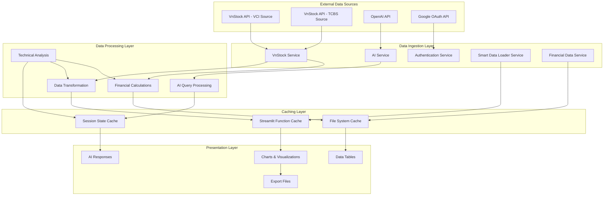
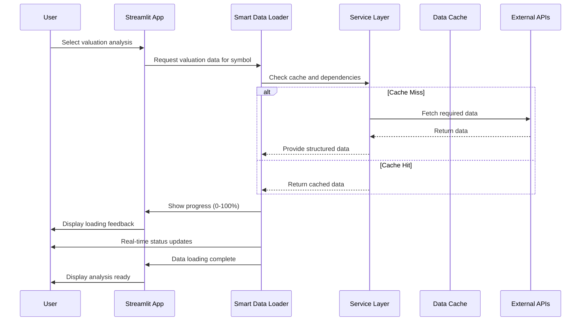
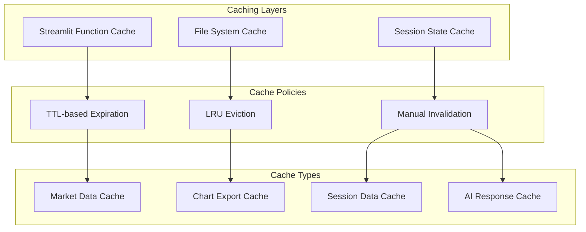
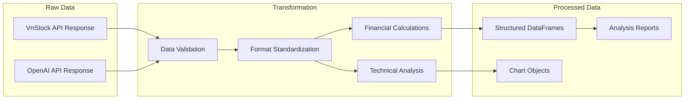

# Data Architecture

## Data Architecture Overview

Finance Bro's data architecture is designed around Vietnamese stock market data with efficient caching, transformation, and AI integration. The system handles real-time market data, historical analysis, and AI-generated insights through a multi-layered approach. 

**Enhanced in v0.2.28**: Smart data loading with progressive feedback, intelligent dependency resolution, and centralized financial data services.

## Data Flow Architecture



## Smart Data Loading Architecture (v0.2.28+)

### Progressive Loading Pattern

The enhanced data loading architecture introduces progressive data loading with intelligent dependency resolution and user feedback:



### Smart Dependency Resolution

The smart data loader automatically manages dependencies between different data types:

```python
# Smart data loading logic
class SmartDataLoader:
    def ensure_valuation_data_loaded(self, symbol: str) -> dict:
        """Ensure all data required for valuation analysis is loaded"""
        
        # Progressive loading with user feedback
        progress_bar = st.progress(0)
        status_text = st.empty()
        
        try:
            # Step 1: Load financial data (60% of progress)
            status_text.text("Loading financial statements...")
            financial_result = self.load_financial_data(symbol)
            progress_bar.progress(0.6)
            
            # Step 2: Load price data and returns (40% of progress)
            status_text.text("Loading price data and calculating returns...")
            price_result = self.load_price_data(symbol)
            progress_bar.progress(1.0)
            
            # Validate and combine results
            combined_data = self.combine_data_sources(
                financial_result, price_result
            )
            
            return {
                "success": True,
                "components": {
                    "financial": financial_result,
                    "price": price_result
                },
                "validation": self.validate_data_integrity(combined_data)
            }
            
        except Exception as e:
            return {
                "success": False,
                "error": str(e),
                "components": {}
            }
```

### Cache Management Strategy

The enhanced architecture implements intelligent cache management:

```python
# Cache key generation and management
class CacheManager:
    def generate_cache_key(self, symbol: str, data_type: str, 
                          period: str, source: str) -> str:
        """Generate consistent cache keys for different data types"""
        return f"{symbol}_{data_type}_{period}_{source}"
    
    def invalidate_cache_for_symbol(self, symbol: str):
        """Clear all cached data for a specific symbol"""
        cache_keys_to_remove = [
            key for key in st.session_state.keys()
            if key.startswith(f"{symbol}_") or symbol in key
        ]
        
        for key in cache_keys_to_remove:
            if key in st.session_state:
                del st.session_state[key]
    
    def get_data_freshness(self, cache_key: str) -> dict:
        """Check if cached data is still fresh"""
        if cache_key in st.session_state:
            metadata = st.session_state.get(f"{cache_key}_metadata", {})
            if "loaded_at" in metadata:
                age = datetime.now() - metadata["loaded_at"]
                return {
                    "is_fresh": age.total_seconds() < CACHE_TTL,
                    "age_seconds": age.total_seconds(),
                    "loaded_at": metadata["loaded_at"]
                }
        return {"is_fresh": False}
```

### Error Handling and Fallback Strategy

The smart data loader implements comprehensive error handling:

```python
# Error handling with graceful degradation
class ErrorHandler:
    def handle_data_loading_error(self, error: Exception, 
                                 symbol: str, data_type: str) -> dict:
        """Handle data loading errors with informative feedback"""
        
        error_info = {
            "success": False,
            "error": str(error),
            "symbol": symbol,
            "data_type": data_type,
            "timestamp": datetime.now(),
            "user_message": self.generate_user_message(error),
            "fallback_available": self.check_fallback_available(symbol, data_type)
        }
        
        # Log error for debugging
        logger.error(f"Data loading failed for {symbol} ({data_type}): {error}")
        
        # Show appropriate user feedback
        if error_info["fallback_available"]:
            st.warning(f"⚠️ {error_info['user_message']}. Using cached data.")
        else:
            st.error(f"❌ {error_info['user_message']}")
        
        return error_info
    
    def check_fallback_available(self, symbol: str, data_type: str) -> bool:
        """Check if fallback data is available"""
        cache_key = f"{symbol}_{data_type}"
        return cache_key in st.session_state and \
               st.session_state[cache_key] is not None
```

## Data Models

### Stock Market Data Models

#### Price Data Model
```python
# Historical Stock Price Data (OHLCV)
StockPriceData = {
    "time": datetime,           # Trading date/time
    "open": float,             # Opening price (VND)
    "high": float,             # Highest price (VND)
    "low": float,              # Lowest price (VND)
    "close": float,            # Closing price (VND)
    "volume": int,             # Trading volume (shares)
    "value": float,            # Trading value (VND)
    "symbol": str              # Stock symbol (e.g., "REE", "VIC")
}

# Data Validation Schema
REQUIRED_OHLCV_COLUMNS = ["Open", "High", "Low", "Close", "Volume"]
MPLFINANCE_COLUMN_MAPPING = {
    "open": "Open",
    "high": "High", 
    "low": "Low",
    "close": "Close",
    "volume": "Volume"
}
```

#### Company Fundamental Data Model
```python
# Company Overview and Fundamentals
CompanyData = {
    "symbol": str,                    # Stock symbol
    "companyName": str,              # Full company name
    "companyNameEng": str,           # English company name
    "exchange": str,                 # Exchange (HSX, HNX, UPCOM)
    "industryID": str,               # Industry classification
    "industryIDv2": str,             # Secondary industry classification
    "organName": str,                # Organization/sector name
    "icbName": str,                  # ICB industry classification
    "website": str,                  # Company website
    "stockRating": str,              # Stock rating
    "deltaInWeek": float,            # Weekly price change
    "deltaInMonth": float,           # Monthly price change
    "deltaInYear": float,            # Yearly price change
    "marketCap": float,              # Market capitalization (VND billion)
    "beta": float,                   # Beta coefficient
    "pe": float,                     # Price-to-earnings ratio
    "pb": float,                     # Price-to-book ratio
    "roe": float,                    # Return on equity (%)
    "roa": float,                    # Return on assets (%)
    "eps": float,                    # Earnings per share
    "bvps": float,                   # Book value per share
    "evEbitda": float,               # EV/EBITDA ratio
    "totalShares": int,              # Total outstanding shares
    "freeFloat": float               # Free float percentage
}
```

#### Investment Fund Data Model
```python
# Vietnamese Investment Fund Data
FundData = {
    "fundCode": str,                 # Fund code (e.g., "VFMVF1")
    "fundName": str,                 # Fund full name
    "fundType": str,                 # Fund type (equity, bond, balanced)
    "nav": float,                    # Net Asset Value
    "navDate": datetime,             # NAV calculation date
    "totalAssets": float,            # Total fund assets (VND billion)
    "numStocks": int,                # Number of holdings
    "assetAllocation": {
        "stocks": float,             # Stock allocation percentage
        "bonds": float,              # Bond allocation percentage
        "cash": float,               # Cash allocation percentage
        "others": float              # Other assets percentage
    },
    "industryAllocation": [
        {
            "industryName": str,     # Industry name
            "allocation": float      # Allocation percentage
        }
    ],
    "topHoldings": [
        {
            "symbol": str,           # Stock symbol
            "name": str,             # Company name
            "allocation": float,     # Portfolio allocation percentage
            "shares": int            # Number of shares held
        }
    ],
    "performance": {
        "1week": float,              # 1-week return (%)
        "1month": float,             # 1-month return (%)
        "3months": float,            # 3-month return (%)
        "6months": float,            # 6-month return (%)
        "1year": float,              # 1-year return (%)
        "3years": float,             # 3-year return (%)
        "inception": float           # Since inception return (%)
    }
}
```

### Technical Analysis Data Models

#### Technical Indicators Model
```python
# Technical Analysis Indicators
TechnicalIndicators = {
    "symbol": str,
    "date": datetime,
    "sma": {
        "sma_20": float,             # 20-day Simple Moving Average
        "sma_50": float,             # 50-day Simple Moving Average
        "sma_200": float             # 200-day Simple Moving Average
    },
    "ema": {
        "ema_12": float,             # 12-day Exponential Moving Average
        "ema_26": float              # 26-day Exponential Moving Average
    },
    "rsi": {
        "rsi_14": float,             # 14-day Relative Strength Index
        "rsi_signal": str            # "overbought", "oversold", "neutral"
    },
    "macd": {
        "macd_line": float,          # MACD line
        "signal_line": float,        # Signal line
        "histogram": float           # MACD histogram
    },
    "bollinger": {
        "upper_band": float,         # Upper Bollinger Band
        "middle_band": float,        # Middle Bollinger Band (SMA)
        "lower_band": float          # Lower Bollinger Band
    },
    "fibonacci": {
        "levels": [float],           # Fibonacci retracement levels
        "swing_high": float,         # Identified swing high
        "swing_low": float           # Identified swing low
    }
}
```

### AI and Analysis Data Models

#### AI Query Model
```python
# AI Analysis Query and Response
AIQueryModel = {
    "query_id": str,                 # Unique query identifier
    "user_query": str,               # Natural language question
    "symbol": str,                   # Target stock symbol
    "query_time": datetime,          # Query timestamp
    "data_context": {
        "price_data": pd.DataFrame,  # Historical price data
        "fundamental_data": dict,    # Company fundamentals
        "technical_data": dict       # Technical indicators
    },
    "generated_code": str,           # Python code generated by AI
    "response": str,                 # AI analysis response
    "chart_generated": bool,         # Whether chart was created
    "chart_path": str,              # Path to generated chart
    "execution_time": float,         # Query processing time (seconds)
    "model_used": str               # AI model version
}
```

#### CrewAI Analysis Model
```python
# Multi-Agent Financial Analysis
CrewAIAnalysis = {
    "analysis_id": str,              # Unique analysis identifier
    "symbol": str,                   # Target stock symbol
    "analysis_type": str,            # "health", "valuation", "risk"
    "start_time": datetime,          # Analysis start time
    "agents": [
        {
            "agent_id": str,         # Agent identifier
            "role": str,             # Agent role
            "task": str,             # Assigned task
            "output": str,           # Agent output
            "execution_time": float  # Task completion time
        }
    ],
    "final_report": {
        "executive_summary": str,    # High-level summary
        "financial_health_score": float,  # Overall health score (1-10)
        "strengths": [str],          # Identified strengths
        "weaknesses": [str],         # Identified weaknesses
        "recommendations": [str],    # Investment recommendations
        "risk_assessment": str,      # Risk analysis
        "target_price": float,       # Price target (if applicable)
        "rating": str               # Investment rating
    },
    "total_execution_time": float,   # Total analysis time
    "data_sources": [str]           # Data sources used
}
```

## Data Storage Strategy

### Caching Architecture



#### Cache Configuration (Enhanced v0.2.28+)
```python
# TTL Settings (seconds)
CACHE_TTL_SETTINGS = {
    "COMPANY_DATA": 3600,        # 1 hour - Company fundamentals
    "STOCK_DATA": 3600,          # 1 hour - Historical price data
    "TECHNICAL_DATA": 300,       # 5 minutes - Technical indicators
    "SCREENER_DATA": 3600,       # 1 hour - Screener results
    "FUND_DATA": 3600,           # 1 hour - Investment fund data
    "AI_RESPONSES": 1800,        # 30 minutes - AI analysis responses
    "FINANCIAL_STATEMENTS": 300, # 5 minutes - Financial statements (smart loading)
    "VALUATION_DATA": 300        # 5 minutes - Complete valuation packages
}

# Enhanced cache implementation with smart loading
@st.cache_data(ttl=CACHE_TTL_SETTINGS["FINANCIAL_STATEMENTS"])
def load_comprehensive_financial_data(symbol: str, period: str = "year", 
                                   source: str = "VCI", company_source: str = "TCBS") -> dict:
    """Comprehensive financial data loading with smart caching"""
    
    # Generate cache key based on all parameters
    cache_key = f"{symbol}_{period}_{source}_{company_source}"
    
    # Check if fresh data exists in session state
    if "financial_data_cache_key" in st.session_state and \
       st.session_state.financial_data_cache_key == cache_key:
        return {
            "dataframes": st.session_state.dataframes,
            "display_dataframes": st.session_state.display_dataframes,
            "metadata": st.session_state.financial_data_metadata,
            "cached": True
        }
    
    # Load fresh data
    financial_data = _load_financial_data_from_api(symbol, period, source, company_source)
    
    # Store in session state for future use
    st.session_state.dataframes = financial_data["dataframes"]
    st.session_state.display_dataframes = financial_data["display_dataframes"]
    st.session_state.financial_data_metadata = financial_data["metadata"]
    st.session_state.financial_data_cache_key = cache_key
    
    return financial_data
```

### File System Storage

```
📁 Data Storage Structure
├── cache/                          # Data cache directory
│   ├── cache_db_0.11.db          # Streamlit cache database
│   ├── market_data/               # Market data cache files
│   │   ├── {symbol}_{date}.pkl    # Pickled stock data
│   │   └── company_{symbol}.json  # Company fundamental data
│   └── technical_data/            # Technical analysis cache
│       └── {symbol}_indicators.pkl
├── exports/                        # Generated files
│   ├── charts/                    # Chart exports
│   │   ├── temp_chart.png         # Latest generated chart
│   │   └── fund_dashboard_{code}_{timestamp}.png
│   ├── reports/                   # Analysis reports
│   │   └── financial_health_{symbol}_{timestamp}.pdf
│   └── tearsheets/               # Portfolio tearsheets
│       └── portfolio_{timestamp}.html
└── logs/                          # Application logs
    ├── finance_bro.log           # Main application log
    ├── pandasai.log              # PandasAI operation log
    └── crewai.log                # CrewAI analysis log
```

## Data Transformation Pipeline

### Data Processing Flow



### Data Transformation Functions

```python
# Data Transformation Pipeline
def transform_vnstock_data(raw_data: dict) -> pd.DataFrame:
    """
    Transforms raw VnStock API response to standardized format
    
    Input: Raw API response with Vietnamese column names
    Output: Standardized DataFrame with English column names
    """
    # Column mapping for VnStock data
    column_mapping = {
        'time': 'Date',
        'open': 'Open', 
        'high': 'High',
        'low': 'Low',
        'close': 'Close',
        'volume': 'Volume'
    }
    
    df = pd.DataFrame(raw_data)
    df = df.rename(columns=column_mapping)
    df['Date'] = pd.to_datetime(df['Date'])
    df = df.set_index('Date')
    
    # Data validation and cleaning
    df = validate_ohlcv_data(df)
    df = handle_missing_values(df)
    
    return df

def calculate_financial_ratios(fundamentals: dict) -> dict:
    """
    Calculates derived financial metrics from fundamental data
    
    Input: Raw company fundamental data
    Output: Enhanced data with calculated ratios
    """
    ratios = {}
    
    # Valuation ratios
    if fundamentals.get('pe') and fundamentals.get('eps'):
        ratios['forward_pe'] = fundamentals['pe'] * 1.1  # Estimated forward P/E
    
    # Profitability ratios
    if fundamentals.get('roe') and fundamentals.get('roa'):
        ratios['equity_multiplier'] = fundamentals['roe'] / fundamentals['roa']
    
    # Market ratios
    if fundamentals.get('marketCap') and fundamentals.get('totalShares'):
        ratios['price_per_share'] = fundamentals['marketCap'] * 1e9 / fundamentals['totalShares']
    
    return {**fundamentals, **ratios}

def validate_ohlcv_data(data: pd.DataFrame) -> pd.DataFrame:
    """
    Validates and cleans OHLCV stock data
    
    Validation rules:
    - All OHLCV columns present
    - No negative prices or volumes
    - High >= Low, High >= Open, High >= Close
    - Reasonable price movements (< 50% daily change)
    """
    # Check required columns
    missing_cols = set(REQUIRED_OHLCV_COLUMNS) - set(data.columns)
    if missing_cols:
        raise ValueError(f"Missing required columns: {missing_cols}")
    
    # Validate price relationships
    invalid_highs = data['High'] < data[['Open', 'Low', 'Close']].max(axis=1)
    if invalid_highs.any():
        logger.warning(f"Found {invalid_highs.sum()} rows with invalid high prices")
        data = data[~invalid_highs]
    
    # Remove extreme outliers (> 50% daily change)
    daily_change = data['Close'].pct_change().abs()
    outliers = daily_change > 0.5
    if outliers.any():
        logger.warning(f"Removing {outliers.sum()} outlier data points")
        data = data[~outliers]
    
    return data
```

## Data Integration Patterns

### API Integration Strategy

```python
# VnStock API Integration with Error Handling
class VnStockDataProvider:
    """Centralized VnStock API integration with robust error handling"""
    
    def __init__(self, primary_source="VCI", secondary_source="TCBS"):
        self.primary_source = primary_source
        self.secondary_source = secondary_source
        self.retry_count = 3
        self.timeout = 30
    
    def fetch_with_fallback(self, fetch_function, *args, **kwargs):
        """Fetch data with source fallback and retry logic"""
        
        # Try primary source
        try:
            return fetch_function(*args, source=self.primary_source, **kwargs)
        except Exception as e:
            logger.warning(f"Primary source {self.primary_source} failed: {e}")
        
        # Try secondary source
        try:
            return fetch_function(*args, source=self.secondary_source, **kwargs)
        except Exception as e:
            logger.warning(f"Secondary source {self.secondary_source} failed: {e}")
        
        # Return cached data if available
        cached_data = self._get_cached_data(*args, **kwargs)
        if cached_data is not None:
            logger.info("Returning cached data due to API failures")
            return cached_data
        
        raise DataUnavailableException("All data sources failed and no cache available")
    
    def _get_cached_data(self, *args, **kwargs):
        """Retrieve cached data as fallback"""
        # Implementation for cache retrieval
        pass

# OpenAI API Integration
class AIDataProcessor:
    """OpenAI API integration for financial analysis"""
    
    def __init__(self, model="gpt-4o-mini", max_tokens=4000):
        self.model = model
        self.max_tokens = max_tokens
        self.rate_limiter = RateLimiter(requests_per_minute=60)
    
    def process_financial_query(self, query: str, data_context: pd.DataFrame) -> dict:
        """Process natural language financial queries with data context"""
        
        # Prepare data context for AI
        data_summary = self._prepare_data_summary(data_context)
        
        # Rate limiting
        self.rate_limiter.wait_if_needed()
        
        # AI processing with error handling
        try:
            response = self._send_ai_request(query, data_summary)
            return self._parse_ai_response(response)
        except RateLimitError:
            logger.warning("Rate limit hit, using cached response if available")
            return self._get_cached_ai_response(query, data_context)
        except Exception as e:
            logger.error(f"AI processing failed: {e}")
            return self._generate_fallback_response(query, data_context)
```

## Data Quality Assurance

### Data Validation Framework

```python
# Data Quality Validation
class DataQualityValidator:
    """Comprehensive data quality validation for financial data"""
    
    def validate_stock_data(self, data: pd.DataFrame, symbol: str) -> ValidationResult:
        """Validate stock price data quality"""
        
        issues = []
        warnings = []
        
        # Completeness checks
        if data.empty:
            issues.append("No data available")
            return ValidationResult(valid=False, issues=issues)
        
        # Data freshness check
        latest_date = data.index.max()
        if (datetime.now() - latest_date).days > 7:
            warnings.append(f"Data may be stale (latest: {latest_date})")
        
        # Price consistency checks
        price_gaps = self._detect_price_gaps(data)
        if len(price_gaps) > 0:
            warnings.append(f"Found {len(price_gaps)} significant price gaps")
        
        # Volume consistency checks
        zero_volume_days = (data['Volume'] == 0).sum()
        if zero_volume_days > len(data) * 0.1:  # More than 10% zero volume days
            warnings.append(f"High number of zero volume days: {zero_volume_days}")
        
        # Technical indicator validation
        if 'SMA_20' in data.columns:
            sma_validity = self._validate_technical_indicators(data)
            if not sma_validity:
                issues.append("Technical indicator calculation errors detected")
        
        return ValidationResult(
            valid=len(issues) == 0,
            issues=issues,
            warnings=warnings,
            data_points=len(data),
            date_range=(data.index.min(), data.index.max())
        )
    
    def _detect_price_gaps(self, data: pd.DataFrame, threshold=0.15) -> list:
        """Detect significant price gaps (> 15% overnight changes)"""
        gaps = []
        daily_change = data['Close'].pct_change().abs()
        significant_gaps = daily_change > threshold
        
        for date in data[significant_gaps].index:
            gaps.append({
                'date': date,
                'change': daily_change[date],
                'prev_close': data['Close'].shift(1)[date],
                'open': data['Open'][date]
            })
        
        return gaps

@dataclass
class ValidationResult:
    """Data validation result container"""
    valid: bool
    issues: List[str]
    warnings: List[str] = field(default_factory=list)
    data_points: int = 0
    date_range: Tuple[datetime, datetime] = None
```

## Performance Optimization

### Data Access Optimization

```python
# Optimized data access patterns
class PerformanceOptimizedDataAccess:
    """Data access layer with performance optimizations"""
    
    def __init__(self):
        self.connection_pool = ConnectionPool(max_connections=10)
        self.batch_size = 1000
        self.parallel_requests = 5
    
    async def batch_fetch_symbols(self, symbols: List[str], date_range: Tuple[str, str]) -> Dict[str, pd.DataFrame]:
        """Fetch data for multiple symbols in parallel"""
        
        semaphore = asyncio.Semaphore(self.parallel_requests)
        
        async def fetch_single_symbol(symbol):
            async with semaphore:
                return symbol, await self._fetch_symbol_data(symbol, date_range)
        
        tasks = [fetch_single_symbol(symbol) for symbol in symbols]
        results = await asyncio.gather(*tasks, return_exceptions=True)
        
        return {symbol: data for symbol, data in results if not isinstance(data, Exception)}
    
    def optimize_dataframe_memory(self, df: pd.DataFrame) -> pd.DataFrame:
        """Optimize DataFrame memory usage through type conversion"""
        
        # Convert float64 to float32 where precision allows
        float_cols = df.select_dtypes(include=['float64']).columns
        df[float_cols] = df[float_cols].astype('float32')
        
        # Convert int64 to int32 where range allows
        int_cols = df.select_dtypes(include=['int64']).columns
        for col in int_cols:
            if df[col].max() < 2147483647:  # int32 max value
                df[col] = df[col].astype('int32')
        
        # Use categorical for repeated string values
        string_cols = df.select_dtypes(include=['object']).columns
        for col in string_cols:
            if df[col].nunique() / len(df) < 0.5:  # Less than 50% unique values
                df[col] = df[col].astype('category')
        
        return df
```

## Data Governance

### Data Lineage and Audit Trail

```python
# Data lineage tracking
class DataLineageTracker:
    """Track data transformations and lineage for audit purposes"""
    
    def __init__(self):
        self.lineage_log = []
    
    def track_transformation(self, operation: str, input_data: Any, output_data: Any, metadata: dict = None):
        """Track a data transformation operation"""
        
        lineage_entry = {
            'timestamp': datetime.now(),
            'operation': operation,
            'input_hash': self._hash_data(input_data),
            'output_hash': self._hash_data(output_data),
            'input_shape': getattr(input_data, 'shape', None),
            'output_shape': getattr(output_data, 'shape', None),
            'metadata': metadata or {}
        }
        
        self.lineage_log.append(lineage_entry)
    
    def get_data_lineage(self, data_hash: str) -> List[dict]:
        """Get the transformation lineage for a specific data hash"""
        lineage = []
        current_hash = data_hash
        
        # Trace back through transformations
        for entry in reversed(self.lineage_log):
            if entry['output_hash'] == current_hash:
                lineage.append(entry)
                current_hash = entry['input_hash']
        
        return list(reversed(lineage))
```

This comprehensive data architecture documentation covers all aspects of Finance Bro's data handling, from models and storage to quality assurance and performance optimization, providing a complete guide for understanding and maintaining the system's data layer.