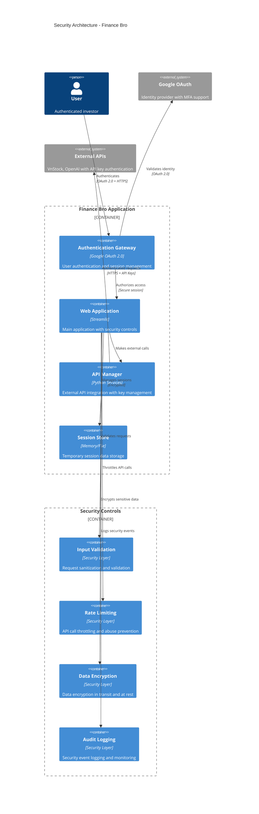
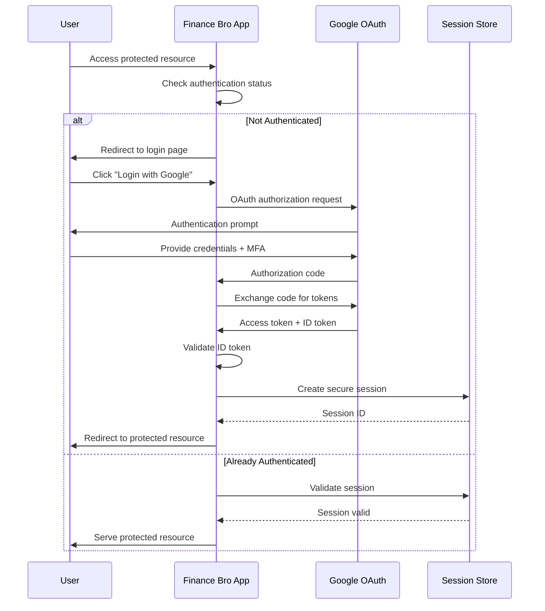

# Security Architecture

## Security Overview

Finance Bro implements a defense-in-depth security strategy appropriate for a financial analysis application handling sensitive market data and user information. The security architecture emphasizes secure authentication, data protection, and minimal attack surface.

## Security Principles

### 1. Zero Trust Architecture
- No implicit trust based on network location
- Verify every request regardless of source
- Principle of least privilege access
- Continuous security validation

### 2. Defense in Depth
- Multiple security layers and controls
- Fail-safe security defaults
- Security through obscurity avoidance
- Comprehensive logging and monitoring

### 3. Privacy by Design
- Minimal data collection and retention
- Purpose limitation for data usage
- Data minimization principles
- User consent and transparency

## Security Architecture Diagram



## Authentication Architecture

### OAuth 2.0 Implementation



### Authentication Configuration

```python
# OAuth 2.0 Configuration (stored in .streamlit/secrets.toml)
OAUTH_CONFIG = {
    "client_id": "google-oauth-client-id",
    "client_secret": "google-oauth-client-secret", 
    "redirect_uri": "https://finance-bro.app/oauth2callback",
    "scope": "openid email profile",
    "response_type": "code",
    "state": "random-state-parameter",
    "nonce": "random-nonce-parameter"
}

# Security Headers for OAuth Flow
SECURITY_HEADERS = {
    "X-Content-Type-Options": "nosniff",
    "X-Frame-Options": "DENY", 
    "X-XSS-Protection": "1; mode=block",
    "Strict-Transport-Security": "max-age=31536000; includeSubDomains",
    "Content-Security-Policy": "default-src 'self'; script-src 'self' 'unsafe-inline'"
}

# Session Security Configuration
SESSION_CONFIG = {
    "cookie_secret": "cryptographically-secure-random-key",
    "session_timeout": 3600,  # 1 hour
    "secure_cookies": True,
    "httponly_cookies": True,
    "samesite": "Strict"
}
```

### Authentication Flow Implementation

```python
# Streamlit Authentication Integration
class AuthenticationManager:
    """Secure authentication management for Finance Bro"""
    
    def __init__(self):
        self.oauth_client = self._initialize_oauth_client()
        self.session_manager = SecureSessionManager()
        
    def handle_authentication(self):
        """Handle user authentication flow"""
        
        # Check existing authentication
        if self._is_user_authenticated():
            return True
        
        # Display login interface
        self._display_login_interface()
        return False
    
    def _is_user_authenticated(self) -> bool:
        """Check if user is authenticated with session validation"""
        
        if not hasattr(st, 'user') or not st.user.is_logged_in:
            return False
        
        # Validate session integrity
        session_valid = self.session_manager.validate_session(
            user_id=st.user.email,
            session_token=st.session_state.get('session_token')
        )
        
        if not session_valid:
            self._logout_user()
            return False
        
        # Check session expiration
        if self.session_manager.is_session_expired(st.user.email):
            self._logout_user()
            return False
        
        return True
    
    def _display_login_interface(self):
        """Display secure login interface"""
        
        st.title("🔒 Authentication Required")
        st.markdown("Please authenticate with Google to access Finance Bro")
        
        # Security notice
        with st.expander("🛡️ Security Information"):
            st.markdown("""
            **Security Features:**
            - OAuth 2.0 authentication via Google
            - No passwords stored by Finance Bro
            - Session encryption and timeout
            - Secure HTTPS communication
            - Minimal data collection
            """)
        
        # Login button with security validation
        if st.button("Login with Google", type="primary"):
            # Generate secure state parameter
            state = secrets.token_urlsafe(32)
            st.session_state.oauth_state = state
            
            # Initiate OAuth flow with security parameters
            st.login(
                provider="google",
                state=state,
                nonce=secrets.token_urlsafe(16)
            )

class SecureSessionManager:
    """Secure session management with encryption and validation"""
    
    def __init__(self):
        self.encryption_key = self._get_encryption_key()
        self.session_timeout = 3600  # 1 hour
        
    def create_session(self, user_id: str) -> str:
        """Create encrypted session with expiration"""
        
        session_data = {
            "user_id": user_id,
            "created_at": datetime.now().isoformat(),
            "expires_at": (datetime.now() + timedelta(seconds=self.session_timeout)).isoformat(),
            "csrf_token": secrets.token_urlsafe(32)
        }
        
        # Encrypt session data
        encrypted_session = self._encrypt_session_data(session_data)
        
        # Store session
        session_token = secrets.token_urlsafe(32)
        self._store_session(session_token, encrypted_session)
        
        return session_token
    
    def validate_session(self, user_id: str, session_token: str) -> bool:
        """Validate session integrity and authenticity"""
        
        try:
            # Retrieve and decrypt session
            encrypted_session = self._get_stored_session(session_token)
            if not encrypted_session:
                return False
            
            session_data = self._decrypt_session_data(encrypted_session)
            
            # Validate user ID
            if session_data.get('user_id') != user_id:
                return False
            
            # Check expiration
            expires_at = datetime.fromisoformat(session_data['expires_at'])
            if datetime.now() > expires_at:
                self._delete_session(session_token)
                return False
            
            return True
            
        except Exception as e:
            logger.warning(f"Session validation failed: {e}")
            return False
```

## API Security

### API Key Management

```python
# Secure API Key Management
class APIKeyManager:
    """Secure management of external API keys"""
    
    def __init__(self):
        self.key_store = SecureKeyStore()
        self.encryption = Fernet(self._get_master_key())
    
    def store_api_key(self, user_id: str, service: str, api_key: str):
        """Store encrypted API key for user"""
        
        # Validate API key format
        if not self._validate_api_key_format(service, api_key):
            raise ValueError(f"Invalid {service} API key format")
        
        # Encrypt API key
        encrypted_key = self.encryption.encrypt(api_key.encode())
        
        # Store with user association
        self.key_store.store_key(
            user_id=user_id,
            service=service,
            encrypted_key=encrypted_key,
            timestamp=datetime.now()
        )
        
        logger.info(f"API key stored for {service} (user: {user_id})")
    
    def retrieve_api_key(self, user_id: str, service: str) -> str:
        """Retrieve and decrypt API key for user"""
        
        encrypted_key = self.key_store.get_key(user_id, service)
        if not encrypted_key:
            return None
        
        try:
            decrypted_key = self.encryption.decrypt(encrypted_key).decode()
            return decrypted_key
        except Exception as e:
            logger.error(f"Failed to decrypt API key for {service}: {e}")
            return None
    
    def _validate_api_key_format(self, service: str, api_key: str) -> bool:
        """Validate API key format for different services"""
        
        patterns = {
            "openai": r"^sk-[A-Za-z0-9]{48}$",
            "vnstock": r"^[A-Za-z0-9-_]{20,}$"
        }
        
        pattern = patterns.get(service)
        if not pattern:
            return True  # Unknown service, allow through
        
        return bool(re.match(pattern, api_key))

# Rate Limiting for API Calls
class RateLimiter:
    """Rate limiting to prevent API abuse"""
    
    def __init__(self, requests_per_minute: int = 60):
        self.requests_per_minute = requests_per_minute
        self.request_times = defaultdict(list)
        
    def is_allowed(self, user_id: str) -> bool:
        """Check if user is within rate limits"""
        
        now = datetime.now()
        user_requests = self.request_times[user_id]
        
        # Remove requests older than 1 minute
        cutoff = now - timedelta(minutes=1)
        user_requests[:] = [req_time for req_time in user_requests if req_time > cutoff]
        
        # Check if under limit
        if len(user_requests) >= self.requests_per_minute:
            return False
        
        # Record this request
        user_requests.append(now)
        return True
    
    def get_retry_after(self, user_id: str) -> int:
        """Get seconds until user can make another request"""
        
        user_requests = self.request_times[user_id]
        if not user_requests:
            return 0
        
        oldest_request = min(user_requests)
        retry_after = 60 - (datetime.now() - oldest_request).seconds
        return max(0, retry_after)
```

### Input Validation and Sanitization

```python
# Input Validation Framework
class InputValidator:
    """Comprehensive input validation and sanitization"""
    
    def __init__(self):
        self.sql_injection_patterns = [
            r"(\bunion\b|\bselect\b|\binsert\b|\bdelete\b|\bupdate\b|\bdrop\b)",
            r"(\bor\b|\band\b)\s+\d+\s*=\s*\d+",
            r"['\"];?\s*(\bor\b|\band\b|\bunion\b)"
        ]
        
        self.xss_patterns = [
            r"<script[^>]*>.*?</script>",
            r"javascript:",
            r"on\w+\s*=",
            r"<iframe[^>]*>"
        ]
    
    def validate_stock_symbol(self, symbol: str) -> str:
        """Validate and sanitize stock symbol input"""
        
        if not symbol:
            raise ValidationError("Stock symbol cannot be empty")
        
        # Remove whitespace and convert to uppercase
        symbol = symbol.strip().upper()
        
        # Validate format (3-4 characters, letters/numbers only)
        if not re.match(r"^[A-Z0-9]{3,4}$", symbol):
            raise ValidationError("Invalid stock symbol format")
        
        # Check against known symbols (if available)
        if hasattr(st.session_state, 'stock_symbols_list'):
            if symbol not in st.session_state.stock_symbols_list:
                raise ValidationError(f"Unknown stock symbol: {symbol}")
        
        return symbol
    
    def validate_date_range(self, start_date: str, end_date: str) -> Tuple[datetime, datetime]:
        """Validate date range inputs"""
        
        try:
            start_dt = datetime.strptime(start_date, "%Y-%m-%d")
            end_dt = datetime.strptime(end_date, "%Y-%m-%d")
        except ValueError:
            raise ValidationError("Invalid date format. Use YYYY-MM-DD")
        
        # Validate date range logic
        if start_dt >= end_dt:
            raise ValidationError("Start date must be before end date")
        
        # Validate reasonable date range (not more than 10 years)
        if (end_dt - start_dt).days > 3650:
            raise ValidationError("Date range cannot exceed 10 years")
        
        # Validate not in future
        if end_dt > datetime.now():
            raise ValidationError("End date cannot be in the future")
        
        return start_dt, end_dt
    
    def sanitize_user_query(self, query: str) -> str:
        """Sanitize user query for AI processing"""
        
        if not query:
            raise ValidationError("Query cannot be empty")
        
        # Length limit
        if len(query) > 1000:
            raise ValidationError("Query too long (max 1000 characters)")
        
        # Check for SQL injection patterns
        for pattern in self.sql_injection_patterns:
            if re.search(pattern, query, re.IGNORECASE):
                raise SecurityError("Potentially dangerous query detected")
        
        # Check for XSS patterns
        for pattern in self.xss_patterns:
            if re.search(pattern, query, re.IGNORECASE):
                raise SecurityError("Potentially dangerous content detected")
        
        # Remove control characters
        query = ''.join(char for char in query if ord(char) >= 32 or char in '\n\t')
        
        return query.strip()

class ValidationError(Exception):
    """Input validation error"""
    pass

class SecurityError(Exception):
    """Security violation error"""
    pass
```

## Data Protection

### Encryption Strategy

```python
# Data Encryption Framework
class DataEncryption:
    """Data encryption for sensitive information"""
    
    def __init__(self):
        self.key_manager = KeyManager()
        self.cipher_suite = Fernet(self.key_manager.get_encryption_key())
    
    def encrypt_sensitive_data(self, data: dict) -> bytes:
        """Encrypt sensitive data like API keys or user preferences"""
        
        json_data = json.dumps(data, separators=(',', ':')).encode()
        encrypted_data = self.cipher_suite.encrypt(json_data)
        
        return encrypted_data
    
    def decrypt_sensitive_data(self, encrypted_data: bytes) -> dict:
        """Decrypt sensitive data"""
        
        try:
            decrypted_data = self.cipher_suite.decrypt(encrypted_data)
            return json.loads(decrypted_data.decode())
        except Exception as e:
            logger.error(f"Decryption failed: {e}")
            raise DecryptionError("Failed to decrypt data")
    
    def hash_user_identifier(self, user_email: str) -> str:
        """Create non-reversible hash of user identifier for logging"""
        
        salt = self.key_manager.get_salt()
        return hashlib.pbkdf2_hmac('sha256', user_email.encode(), salt, 100000).hex()

class KeyManager:
    """Cryptographic key management"""
    
    def __init__(self):
        self.key_file = Path(".streamlit/keys.env")
        self._ensure_keys_exist()
    
    def get_encryption_key(self) -> bytes:
        """Get or generate encryption key"""
        
        key_b64 = os.environ.get("FINANCE_BRO_ENCRYPTION_KEY")
        if not key_b64:
            # Generate new key
            key = Fernet.generate_key()
            key_b64 = base64.b64encode(key).decode()
            
            # Store securely (in production, use proper key management)
            self._store_key_securely("FINANCE_BRO_ENCRYPTION_KEY", key_b64)
            
        return base64.b64decode(key_b64.encode())
    
    def get_salt(self) -> bytes:
        """Get or generate salt for hashing"""
        
        salt_b64 = os.environ.get("FINANCE_BRO_SALT")
        if not salt_b64:
            salt = os.urandom(32)
            salt_b64 = base64.b64encode(salt).decode()
            self._store_key_securely("FINANCE_BRO_SALT", salt_b64)
            
        return base64.b64decode(salt_b64.encode())
```

### Data Privacy Controls

```python
# Privacy Controls and Data Minimization
class PrivacyManager:
    """Privacy controls and data minimization"""
    
    def __init__(self):
        self.data_retention_policy = {
            "session_data": timedelta(hours=1),
            "cache_data": timedelta(hours=24),
            "chart_exports": timedelta(days=7),
            "logs": timedelta(days=30)
        }
    
    def apply_data_minimization(self, user_data: dict) -> dict:
        """Apply data minimization principles"""
        
        # Only keep essential user information
        essential_fields = ["email", "name", "auth_timestamp"]
        minimized_data = {
            key: value for key, value in user_data.items() 
            if key in essential_fields
        }
        
        # Hash identifiable information
        if "email" in minimized_data:
            minimized_data["user_hash"] = self._hash_email(minimized_data["email"])
            del minimized_data["email"]
        
        return minimized_data
    
    def schedule_data_cleanup(self):
        """Schedule automatic data cleanup based on retention policy"""
        
        for data_type, retention_period in self.data_retention_policy.items():
            cutoff_time = datetime.now() - retention_period
            self._cleanup_data_type(data_type, cutoff_time)
    
    def _cleanup_data_type(self, data_type: str, cutoff_time: datetime):
        """Clean up specific data type based on retention policy"""
        
        if data_type == "session_data":
            self._cleanup_expired_sessions(cutoff_time)
        elif data_type == "cache_data":
            self._cleanup_old_cache_files(cutoff_time)
        elif data_type == "chart_exports":
            self._cleanup_old_chart_files(cutoff_time)
        elif data_type == "logs":
            self._cleanup_old_log_files(cutoff_time)
    
    def get_user_data_summary(self, user_id: str) -> dict:
        """Provide summary of user data for transparency"""
        
        return {
            "data_collected": [
                "Google account email and name (for authentication)",
                "OpenAI API key (encrypted, user-provided)",
                "Session data (temporary, auto-expires)",
                "Usage analytics (anonymized)"
            ],
            "data_not_collected": [
                "Financial account information",
                "Trading history or portfolio holdings",
                "Personal financial data",
                "Passwords or credentials"
            ],
            "data_retention": {
                "Session data": "1 hour",
                "Cache data": "24 hours", 
                "Chart exports": "7 days",
                "Logs": "30 days (anonymized)"
            },
            "data_sharing": "No data shared with third parties except as required for service functionality (Google OAuth, OpenAI API)"
        }
```

## Security Monitoring

### Audit Logging

```python
# Security Event Logging
class SecurityLogger:
    """Comprehensive security event logging"""
    
    def __init__(self):
        self.logger = self._setup_security_logger()
        self.event_types = {
            "AUTH_SUCCESS": "Authentication successful",
            "AUTH_FAILURE": "Authentication failed", 
            "SESSION_CREATE": "Session created",
            "SESSION_EXPIRE": "Session expired",
            "API_KEY_STORE": "API key stored",
            "API_KEY_ACCESS": "API key accessed",
            "RATE_LIMIT_HIT": "Rate limit exceeded",
            "VALIDATION_ERROR": "Input validation failed",
            "SECURITY_VIOLATION": "Security violation detected"
        }
    
    def log_security_event(self, event_type: str, user_id: str = None, details: dict = None, ip_address: str = None):
        """Log security-related events"""
        
        event_data = {
            "timestamp": datetime.now().isoformat(),
            "event_type": event_type,
            "event_description": self.event_types.get(event_type, "Unknown event"),
            "user_hash": self._hash_user_id(user_id) if user_id else None,
            "ip_address": self._anonymize_ip(ip_address) if ip_address else None,
            "details": details or {},
            "session_id": self._get_session_id()
        }
        
        self.logger.info(json.dumps(event_data, default=str))
    
    def log_authentication_attempt(self, success: bool, user_email: str, ip_address: str, user_agent: str):
        """Log authentication attempts"""
        
        event_type = "AUTH_SUCCESS" if success else "AUTH_FAILURE"
        details = {
            "user_agent": user_agent[:100],  # Truncate user agent
            "auth_method": "google_oauth"
        }
        
        if not success:
            details["failure_reason"] = "OAuth validation failed"
        
        self.log_security_event(
            event_type=event_type,
            user_id=user_email,
            details=details,
            ip_address=ip_address
        )
    
    def log_suspicious_activity(self, activity_type: str, user_id: str, details: dict):
        """Log suspicious security activity"""
        
        self.log_security_event(
            event_type="SECURITY_VIOLATION",
            user_id=user_id,
            details={
                "activity_type": activity_type,
                "severity": "HIGH",
                **details
            }
        )
        
        # Alert administrators for high-severity events
        self._send_security_alert(activity_type, user_id, details)
    
    def _setup_security_logger(self):
        """Setup dedicated security logger"""
        
        security_logger = logging.getLogger("finance_bro.security")
        security_logger.setLevel(logging.INFO)
        
        # File handler for security logs
        handler = logging.handlers.RotatingFileHandler(
            "logs/security.log",
            maxBytes=10*1024*1024,  # 10MB
            backupCount=5
        )
        
        formatter = logging.Formatter(
            '%(asctime)s - %(name)s - %(levelname)s - %(message)s'
        )
        handler.setFormatter(formatter)
        security_logger.addHandler(handler)
        
        return security_logger

# Threat Detection
class ThreatDetector:
    """Automated threat detection and response"""
    
    def __init__(self):
        self.failed_login_tracker = defaultdict(list)
        self.rate_limit_tracker = defaultdict(list)
        self.security_logger = SecurityLogger()
        
    def detect_brute_force_attempt(self, user_id: str, ip_address: str) -> bool:
        """Detect potential brute force authentication attempts"""
        
        now = datetime.now()
        cutoff = now - timedelta(minutes=15)
        
        # Track failed logins by IP
        ip_failures = self.failed_login_tracker[ip_address]
        ip_failures[:] = [attempt for attempt in ip_failures if attempt > cutoff]
        ip_failures.append(now)
        
        # Alert if more than 5 failures in 15 minutes
        if len(ip_failures) > 5:
            self.security_logger.log_suspicious_activity(
                "BRUTE_FORCE_ATTEMPT",
                user_id,
                {
                    "ip_address": ip_address,
                    "failed_attempts": len(ip_failures),
                    "time_window": "15_minutes"
                }
            )
            return True
        
        return False
    
    def detect_api_abuse(self, user_id: str, api_calls_per_minute: int) -> bool:
        """Detect potential API abuse"""
        
        threshold = 100  # calls per minute
        
        if api_calls_per_minute > threshold:
            self.security_logger.log_suspicious_activity(
                "API_ABUSE",
                user_id,
                {
                    "calls_per_minute": api_calls_per_minute,
                    "threshold": threshold
                }
            )
            return True
        
        return False
```

## Incident Response

### Security Incident Response Plan

```python
# Automated Incident Response
class IncidentResponseManager:
    """Automated security incident response"""
    
    def __init__(self):
        self.security_logger = SecurityLogger()
        self.notification_channels = self._setup_notification_channels()
        
    def handle_security_incident(self, incident_type: str, severity: str, details: dict):
        """Handle security incidents with appropriate response"""
        
        incident_id = self._generate_incident_id()
        
        # Log the incident
        self.security_logger.log_security_event(
            "SECURITY_INCIDENT",
            details={"incident_id": incident_id, "severity": severity, **details}
        )
        
        # Execute response based on severity
        if severity == "CRITICAL":
            self._handle_critical_incident(incident_id, details)
        elif severity == "HIGH":
            self._handle_high_severity_incident(incident_id, details)
        elif severity == "MEDIUM":
            self._handle_medium_severity_incident(incident_id, details)
        
        return incident_id
    
    def _handle_critical_incident(self, incident_id: str, details: dict):
        """Handle critical security incidents"""
        
        # Immediate actions for critical incidents
        actions = [
            "Disable affected user sessions",
            "Block suspicious IP addresses", 
            "Alert security team",
            "Initiate incident response protocol"
        ]
        
        for action in actions:
            try:
                self._execute_response_action(action, details)
                self.security_logger.log_security_event(
                    "INCIDENT_RESPONSE_ACTION",
                    details={"incident_id": incident_id, "action": action, "status": "SUCCESS"}
                )
            except Exception as e:
                self.security_logger.log_security_event(
                    "INCIDENT_RESPONSE_ERROR", 
                    details={"incident_id": incident_id, "action": action, "error": str(e)}
                )
    
    def _execute_response_action(self, action: str, details: dict):
        """Execute specific incident response actions"""
        
        if action == "Disable affected user sessions":
            user_id = details.get("user_id")
            if user_id:
                self._disable_user_sessions(user_id)
        
        elif action == "Block suspicious IP addresses":
            ip_address = details.get("ip_address")
            if ip_address:
                self._block_ip_address(ip_address)
        
        elif action == "Alert security team":
            self._send_security_alert(details)
```

This comprehensive security architecture documentation provides a complete framework for understanding and implementing security controls in Finance Bro, ensuring protection of user data and system integrity while maintaining usability for financial analysis activities.