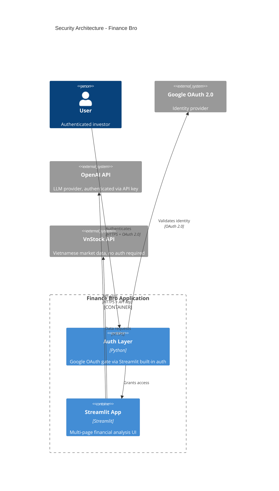
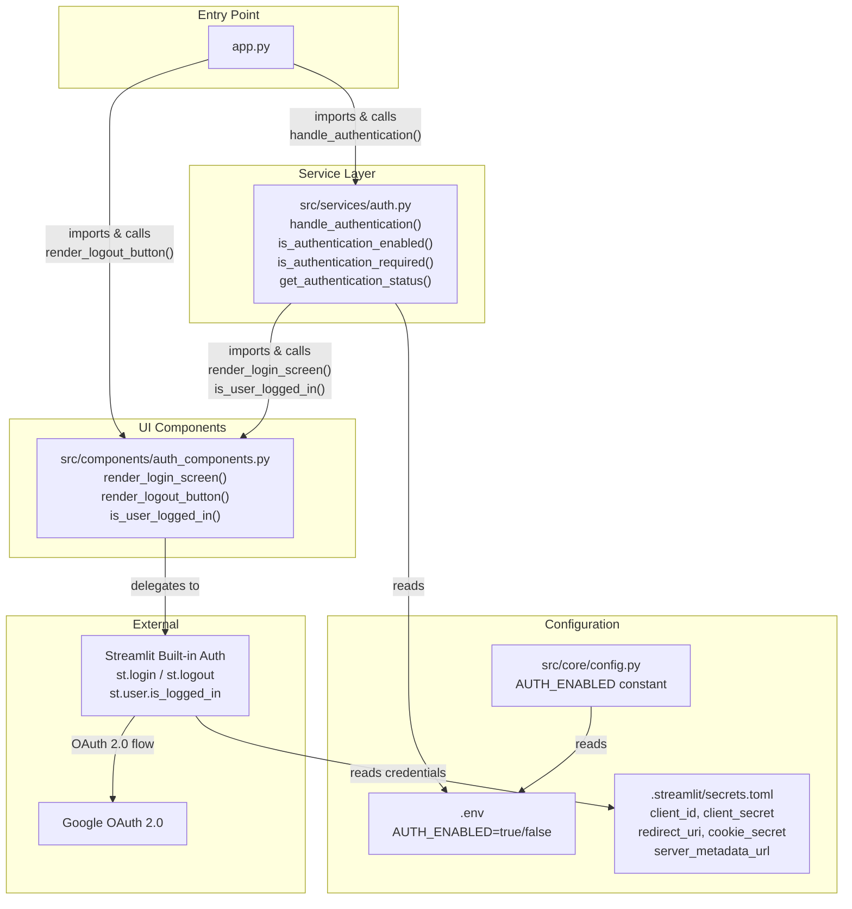
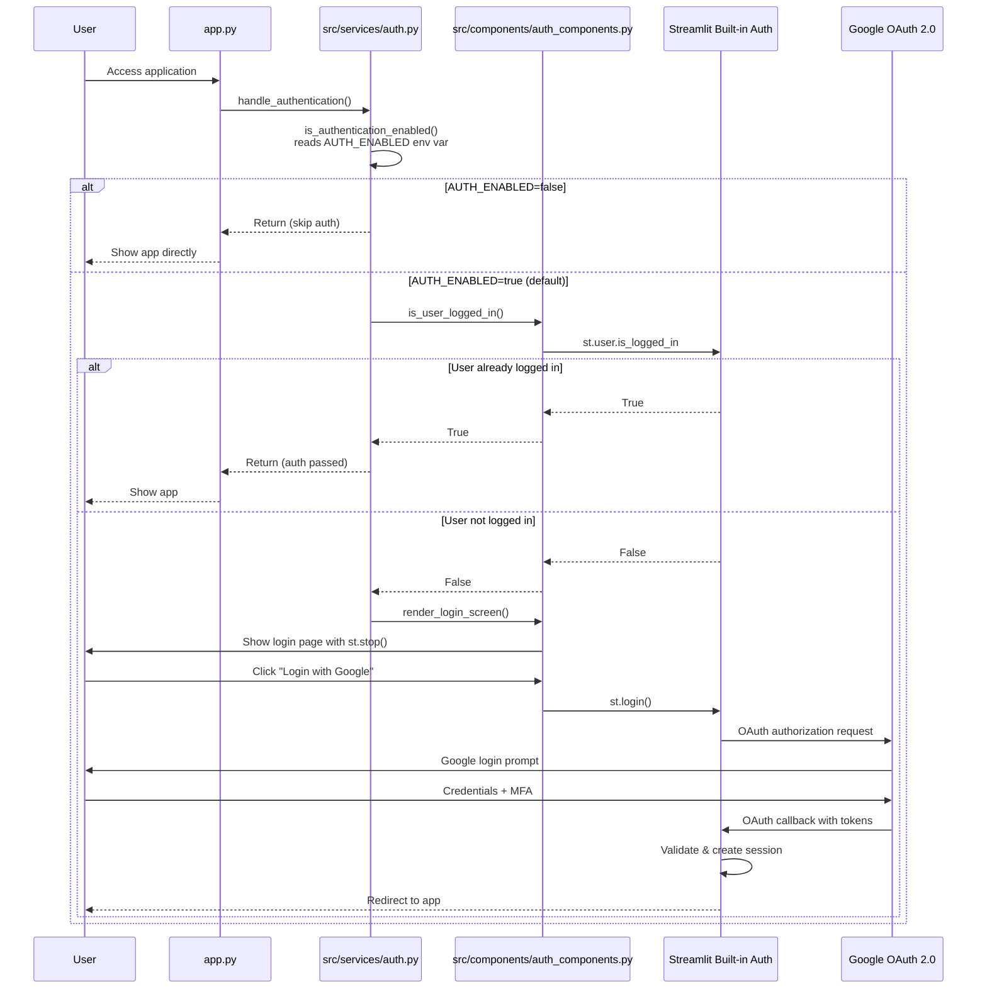

# Security Architecture

## 1. Security Overview

Finance Bro is a single-user Streamlit application for Vietnamese stock market analysis. Its security layer is intentionally simple:

- **Authentication**: Google OAuth 2.0 via Streamlit's built-in auth (`st.login` / `st.logout` / `st.user`)
- **API key management**: OpenAI key loaded from environment variable or entered at runtime, stored in `st.session_state`
- **Transport security**: HTTPS enforced by the deployment platform (Render)
- **No persistent user data**: The app does not store user data beyond the current Streamlit session

There is no custom encryption, rate limiting, audit logging, or threat detection. These are not needed for the current scope (single-user, no database, no sensitive data storage).

## 2. Security Architecture Diagram



## 3. Authentication Architecture

### 3a. Component Relationship Diagram



### 3b. OAuth Flow Sequence Diagram



### 3c. File & Function Documentation

#### `src/services/auth.py`

The authentication service layer. All functions are pure Python with no Streamlit UI calls — UI is delegated to `auth_components.py`.

| Function | Signature | Purpose |
|----------|-----------|---------|
| `is_authentication_enabled` | `() -> bool` | Reads `AUTH_ENABLED` env var (default `"true"`). Returns `True` if auth is on. |
| `is_authentication_required` | `() -> bool` | Returns `True` when auth is enabled AND user is not logged in. |
| `handle_authentication` | `() -> None` | Main entry point called by `app.py`. If auth is required, calls `render_login_screen()` which halts execution via `st.stop()`. |
| `get_authentication_status` | `() -> dict` | Returns `{"enabled": bool, "required": bool, "logged_in": bool}` for debugging/status checks. |

#### `src/components/auth_components.py`

UI components for authentication. All Streamlit calls (`st.login`, `st.logout`, `st.user`) live here.

| Function | Signature | Purpose |
|----------|-----------|---------|
| `render_login_screen` | `() -> None` | Displays login title, "Login with Google" button (calls `st.login()` on click), info text, then `st.stop()` to halt execution. |
| `render_logout_button` | `() -> None` | Renders a "Logout" button that calls `st.logout()` on click. Used in the sidebar. |
| `is_user_logged_in` | `() -> bool` | Wraps `st.user.is_logged_in` with `AttributeError` handling for non-Streamlit contexts (e.g. tests). |

#### `src/core/config.py`

```python
AUTH_ENABLED = os.getenv("AUTH_ENABLED", "true").lower() == "true"
```

Mirrors the logic in `auth.py`. Used by other modules that need the auth flag without importing the auth service.

#### Configuration: `.streamlit/secrets.toml`

Required for Google OAuth (read by Streamlit's built-in auth, not by application code):

```toml
[auth]
client_id = "your-google-client-id"
client_secret = "your-google-client-secret"
redirect_uri = "http://localhost:8501/oauth2callback"
cookie_secret = "your-random-secret-string"
server_metadata_url = "https://accounts.google.com/.well-known/openid-configuration"
```

#### Development vs Production Mode

| Setting | Development | Production |
|---------|-------------|------------|
| `AUTH_ENABLED` | `false` (skip auth) | `true` (default) |
| `redirect_uri` | `http://localhost:8501/oauth2callback` | `https://your-domain.com/oauth2callback` |
| OAuth credentials | Test project | Production project |

Set `AUTH_ENABLED=false` in `.env` to bypass authentication during local development.

## 4. API Key Security

### How the OpenAI API Key Is Handled

The API key flow in `app.py` (lines 22–46):

1. **Environment variable check**: On first load, `os.environ.get("OPENAI_API_KEY", "")` is read into `st.session_state.api_key`
2. **Manual entry fallback**: If no key is found, the user is prompted to enter one via `st.text_input(type="password")`
3. **Basic validation**: The key must start with `"sk-"` before being accepted
4. **Runtime storage**: The key is stored in `st.session_state.api_key` and `os.environ["OPENAI_API_KEY"]` for the duration of the session
5. **Execution gate**: If no valid key is available, `st.stop()` halts the app

### What This Means

- The API key is **not encrypted** at rest — it lives in memory (`st.session_state`) and as an environment variable
- The key is **not persisted** to disk by the application (session state is ephemeral)
- In production (Render), the key is set as an environment variable in the deployment configuration
- The `type="password"` parameter on the text input masks the key in the browser UI

## 5. Security Boundaries & Limitations

### What Is Implemented

| Control | Implementation |
|---------|---------------|
| Authentication | Google OAuth 2.0 via Streamlit built-in auth |
| Auth toggle | `AUTH_ENABLED` env var for dev/prod modes |
| API key masking | `st.text_input(type="password")` for browser display |
| Transport encryption | HTTPS via deployment platform (Render) |
| Session management | Streamlit's built-in session handling |

### What Is NOT Implemented

| Control | Status | Why It's Acceptable |
|---------|--------|-------------------|
| Rate limiting | Not implemented | Single-user app; external APIs (OpenAI, VnStock) have their own rate limits |
| API key encryption at rest | Not implemented | Key lives in memory only; no persistent storage |
| Audit logging | Not implemented | No compliance requirements; no multi-user access |
| Input sanitization | Not implemented | No database; user queries go to PandasAI/OpenAI which handle their own safety |
| Threat detection | Not implemented | No attack surface beyond what Streamlit/Google OAuth already protect |
| RBAC / Authorization | Not implemented | Single-user app; all authenticated users have full access |
| CSRF protection | Not implemented | Handled by Streamlit framework internally |
| Session encryption | Not implemented | Handled by Streamlit's built-in session/cookie management |

## 6. Security Recommendations (Future)

If Finance Bro scales to multi-user or handles sensitive financial data, consider:

- **API key encryption**: Encrypt stored API keys with a user-specific key (e.g., `cryptography.fernet`)
- **Rate limiting**: Add per-user rate limits for OpenAI API calls to prevent cost overruns
- **Audit logging**: Log authentication events and API usage for compliance
- **Session timeout**: Configure explicit session expiration beyond Streamlit defaults
- **Input validation**: Add server-side validation for stock symbols and date ranges before API calls
- **Secrets management**: Migrate from environment variables to a secrets manager (e.g., HashiCorp Vault, AWS Secrets Manager)

None of these are currently implemented.
