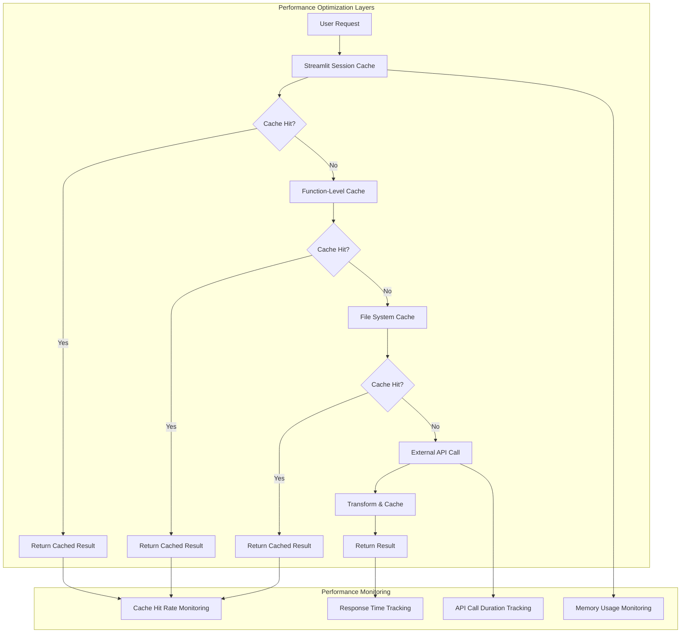
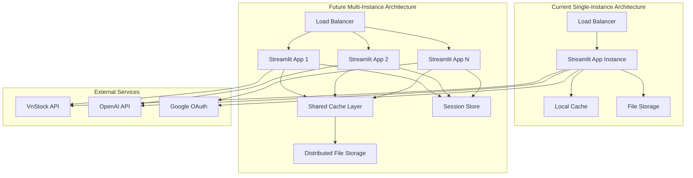

# Quality Attributes and Cross-Cutting Concerns

## Quality Attributes Overview

Finance Bro's architecture is designed to meet specific quality attributes critical for a financial analysis platform. This document details how the system addresses performance, reliability, scalability, maintainability, usability, and other quality concerns.

## Quality Attribute Scenarios

### Performance

#### Scenario: Page Load Performance
- **Stimulus**: User navigates to a new analysis page
- **Environment**: Peak usage with 50+ concurrent users
- **Response**: Page loads and displays initial content
- **Measure**: < 2 seconds for page load, < 5 seconds for data visualization

#### Scenario: AI Query Processing
- **Stimulus**: User submits natural language financial query
- **Environment**: Normal operation with cached data available
- **Response**: AI processes query and generates response with chart
- **Measure**: < 10 seconds for complete response including chart generation

#### Performance Architecture



#### Performance Implementation

```python
# Performance Monitoring and Optimization
class PerformanceManager:
    """Performance monitoring and optimization for Finance Bro"""
    
    def __init__(self):
        self.metrics_collector = MetricsCollector()
        self.cache_optimizer = CacheOptimizer()
        self.performance_targets = {
            "page_load_time": 2.0,  # seconds
            "ai_query_time": 10.0,  # seconds
            "chart_generation_time": 5.0,  # seconds
            "api_response_time": 3.0,  # seconds
            "cache_hit_rate": 0.80  # 80%
        }
    
    @contextmanager
    def measure_performance(self, operation_name: str):
        """Context manager for measuring operation performance"""
        
        start_time = time.time()
        start_memory = psutil.Process().memory_info().rss
        
        try:
            yield
        finally:
            end_time = time.time()
            end_memory = psutil.Process().memory_info().rss
            
            duration = end_time - start_time
            memory_delta = end_memory - start_memory
            
            self.metrics_collector.record_metric(
                operation=operation_name,
                duration=duration,
                memory_delta=memory_delta,
                timestamp=datetime.now()
            )
            
            # Alert if performance target exceeded
            target = self.performance_targets.get(operation_name)
            if target and duration > target:
                self._handle_performance_alert(operation_name, duration, target)
    
    def optimize_cache_strategy(self):
        """Dynamically optimize caching based on usage patterns"""
        
        cache_stats = self.cache_optimizer.analyze_cache_usage()
        
        # Adjust TTL based on hit rates
        for cache_type, stats in cache_stats.items():
            hit_rate = stats['hits'] / (stats['hits'] + stats['misses'])
            
            if hit_rate < 0.5:  # Low hit rate
                # Increase TTL to cache data longer
                new_ttl = min(stats['current_ttl'] * 1.5, 7200)  # Max 2 hours
                self.cache_optimizer.update_ttl(cache_type, new_ttl)
                logger.info(f"Increased TTL for {cache_type} to {new_ttl}s (hit rate: {hit_rate:.2f})")
            
            elif hit_rate > 0.9:  # Very high hit rate
                # Consider reducing TTL to free memory
                new_ttl = max(stats['current_ttl'] * 0.8, 300)  # Min 5 minutes
                self.cache_optimizer.update_ttl(cache_type, new_ttl)
                logger.info(f"Reduced TTL for {cache_type} to {new_ttl}s (hit rate: {hit_rate:.2f})")

# Caching Strategy Implementation
class CacheOptimizer:
    """Advanced caching optimization strategies"""
    
    def __init__(self):
        self.cache_statistics = defaultdict(lambda: {
            'hits': 0, 'misses': 0, 'current_ttl': 3600
        })
    
    @st.cache_data(ttl=None, show_spinner="Loading optimized data...")
    def intelligent_cache_data(self, cache_key: str, data_fetcher: callable, **kwargs):
        """Intelligent caching with dynamic TTL adjustment"""
        
        # Get current TTL for this cache type
        ttl = self._get_dynamic_ttl(cache_key)
        
        # Use function caching with dynamic TTL
        @st.cache_data(ttl=ttl)
        def cached_fetcher():
            return data_fetcher(**kwargs)
        
        try:
            result = cached_fetcher()
            self.cache_statistics[cache_key]['hits'] += 1
            return result
        except Exception as e:
            self.cache_statistics[cache_key]['misses'] += 1
            logger.error(f"Cache miss for {cache_key}: {e}")
            raise
    
    def _get_dynamic_ttl(self, cache_key: str) -> int:
        """Calculate dynamic TTL based on data type and usage patterns"""
        
        base_ttls = {
            'stock_data': 3600,      # 1 hour for stock data
            'company_data': 7200,    # 2 hours for company fundamentals
            'technical_data': 300,   # 5 minutes for technical indicators
            'ai_responses': 1800     # 30 minutes for AI responses
        }
        
        base_ttl = base_ttls.get(cache_key, 3600)
        
        # Adjust based on usage patterns
        stats = self.cache_statistics[cache_key]
        total_requests = stats['hits'] + stats['misses']
        
        if total_requests > 0:
            hit_rate = stats['hits'] / total_requests
            
            # High hit rate: extend TTL
            if hit_rate > 0.8:
                return int(base_ttl * 1.5)
            # Low hit rate: reduce TTL
            elif hit_rate < 0.3:
                return int(base_ttl * 0.5)
        
        return base_ttl
```

### Reliability

#### Scenario: External API Failure
- **Stimulus**: VnStock API becomes unavailable
- **Environment**: Normal operation during market hours
- **Response**: System gracefully degrades to cached data and fallback sources
- **Measure**: 99.9% uptime, automatic recovery within 5 minutes

#### Scenario: AI Service Disruption
- **Stimulus**: OpenAI API rate limit exceeded or service unavailable
- **Environment**: High usage period with multiple concurrent AI queries
- **Response**: System provides cached responses and queues new requests
- **Measure**: No data loss, degraded functionality notification to users

#### Reliability Implementation

```python
# Reliability and Fault Tolerance
class ReliabilityManager:
    """Comprehensive reliability and fault tolerance management"""
    
    def __init__(self):
        self.circuit_breaker = CircuitBreaker()
        self.retry_manager = RetryManager()
        self.fallback_manager = FallbackManager()
        self.health_monitor = HealthMonitor()
    
    def reliable_api_call(self, api_function: callable, fallback_function: callable = None, **kwargs):
        """Make reliable API calls with circuit breaker and retry logic"""
        
        @self.circuit_breaker.protected
        @self.retry_manager.with_retry(max_attempts=3, backoff_multiplier=1.5)
        def protected_call():
            return api_function(**kwargs)
        
        try:
            return protected_call()
        except CircuitBreakerOpenException:
            logger.warning(f"Circuit breaker open for {api_function.__name__}")
            if fallback_function:
                return fallback_function(**kwargs)
            else:
                return self.fallback_manager.get_cached_fallback(api_function.__name__, **kwargs)
        except Exception as e:
            logger.error(f"API call failed after retries: {e}")
            if fallback_function:
                return fallback_function(**kwargs)
            raise

class CircuitBreaker:
    """Circuit breaker pattern implementation"""
    
    def __init__(self, failure_threshold=5, timeout=60):
        self.failure_threshold = failure_threshold
        self.timeout = timeout
        self.failure_count = 0
        self.last_failure_time = None
        self.state = "CLOSED"  # CLOSED, OPEN, HALF_OPEN
    
    def protected(self, func):
        """Decorator to protect functions with circuit breaker"""
        
        def wrapper(*args, **kwargs):
            if self.state == "OPEN":
                if time.time() - self.last_failure_time > self.timeout:
                    self.state = "HALF_OPEN"
                    logger.info("Circuit breaker transitioning to HALF_OPEN")
                else:
                    raise CircuitBreakerOpenException("Circuit breaker is OPEN")
            
            try:
                result = func(*args, **kwargs)
                
                if self.state == "HALF_OPEN":
                    self.state = "CLOSED"
                    self.failure_count = 0
                    logger.info("Circuit breaker reset to CLOSED")
                
                return result
                
            except Exception as e:
                self.failure_count += 1
                self.last_failure_time = time.time()
                
                if self.failure_count >= self.failure_threshold:
                    self.state = "OPEN"
                    logger.warning(f"Circuit breaker opened after {self.failure_count} failures")
                
                raise e
        
        return wrapper

class RetryManager:
    """Intelligent retry management with exponential backoff"""
    
    def with_retry(self, max_attempts=3, backoff_multiplier=2, base_delay=1):
        """Decorator for retry logic with exponential backoff"""
        
        def decorator(func):
            def wrapper(*args, **kwargs):
                for attempt in range(max_attempts):
                    try:
                        return func(*args, **kwargs)
                    except Exception as e:
                        if attempt == max_attempts - 1:
                            logger.error(f"Function {func.__name__} failed after {max_attempts} attempts")
                            raise e
                        
                        delay = base_delay * (backoff_multiplier ** attempt)
                        logger.warning(f"Attempt {attempt + 1} failed, retrying in {delay}s: {e}")
                        time.sleep(delay)
            
            return wrapper
        return decorator

class FallbackManager:
    """Manage fallback strategies for failed operations"""
    
    def __init__(self):
        self.fallback_cache = {}
        self.fallback_strategies = {
            'get_stock_data': self._stock_data_fallback,
            'get_company_overview': self._company_data_fallback,
            'ai_query': self._ai_query_fallback
        }
    
    def get_cached_fallback(self, operation_name: str, **kwargs):
        """Get cached fallback data for failed operations"""
        
        cache_key = f"{operation_name}_{hash(str(kwargs))}"
        fallback_data = self.fallback_cache.get(cache_key)
        
        if fallback_data:
            logger.info(f"Using cached fallback for {operation_name}")
            return fallback_data
        
        # Try specific fallback strategy
        strategy = self.fallback_strategies.get(operation_name)
        if strategy:
            return strategy(**kwargs)
        
        raise FallbackUnavailableException(f"No fallback available for {operation_name}")
    
    def _stock_data_fallback(self, symbol: str, **kwargs):
        """Fallback strategy for stock data"""
        
        # Try alternative data source or return last known data
        cached_data = self._get_last_known_data(f"stock_{symbol}")
        if cached_data:
            st.warning("⚠️ Using cached data - live data temporarily unavailable")
            return cached_data
        
        # Return sample data for demo purposes
        st.error("❌ Market data temporarily unavailable")
        return self._generate_sample_data(symbol)
```

### Scalability

#### Scenario: Concurrent User Growth
- **Stimulus**: User base grows from 10 to 100 concurrent users
- **Environment**: Peak market hours with high analysis activity
- **Response**: System maintains performance with horizontal scaling
- **Measure**: Linear scalability up to 100 concurrent users, < 10% performance degradation

#### Scalability Architecture



#### Scalability Implementation

```python
# Scalability Management
class ScalabilityManager:
    """Manage scalability concerns and horizontal scaling preparation"""
    
    def __init__(self):
        self.load_monitor = LoadMonitor()
        self.session_manager = DistributedSessionManager()
        self.cache_coordinator = CacheCoordinator()
    
    def monitor_system_load(self):
        """Monitor system load and recommend scaling actions"""
        
        current_load = self.load_monitor.get_current_load()
        
        recommendations = []
        
        # CPU utilization check
        if current_load['cpu_percent'] > 80:
            recommendations.append({
                'type': 'CPU_HIGH',
                'action': 'Consider horizontal scaling',
                'priority': 'HIGH'
            })
        
        # Memory utilization check
        if current_load['memory_percent'] > 85:
            recommendations.append({
                'type': 'MEMORY_HIGH', 
                'action': 'Clear cache or add memory',
                'priority': 'MEDIUM'
            })
        
        # Concurrent user check
        if current_load['concurrent_users'] > 50:
            recommendations.append({
                'type': 'USER_LOAD_HIGH',
                'action': 'Prepare for horizontal scaling',
                'priority': 'MEDIUM'
            })
        
        return recommendations
    
    def prepare_for_horizontal_scaling(self):
        """Prepare system components for horizontal scaling"""
        
        preparations = []
        
        # 1. Externalize session storage
        if not self.session_manager.is_externalized():
            preparations.append({
                'component': 'Session Storage',
                'action': 'Move to external Redis/database',
                'effort': 'MEDIUM'
            })
        
        # 2. Shared cache layer
        if not self.cache_coordinator.is_distributed():
            preparations.append({
                'component': 'Cache Layer',
                'action': 'Implement distributed caching',
                'effort': 'HIGH'
            })
        
        # 3. File storage coordination
        preparations.append({
            'component': 'File Storage',
            'action': 'Move to shared storage (S3, NFS)',
            'effort': 'MEDIUM'
        })
        
        return preparations

class LoadMonitor:
    """System load monitoring and metrics collection"""
    
    def __init__(self):
        self.metrics_history = deque(maxlen=100)  # Keep last 100 measurements
        
    def get_current_load(self) -> dict:
        """Get current system load metrics"""
        
        load_metrics = {
            'timestamp': datetime.now(),
            'cpu_percent': psutil.cpu_percent(interval=1),
            'memory_percent': psutil.virtual_memory().percent,
            'disk_usage_percent': psutil.disk_usage('/').percent,
            'concurrent_users': self._estimate_concurrent_users(),
            'active_sessions': len(st.session_state) if hasattr(st, 'session_state') else 0,
            'cache_size_mb': self._get_cache_size_mb()
        }
        
        self.metrics_history.append(load_metrics)
        return load_metrics
    
    def _estimate_concurrent_users(self) -> int:
        """Estimate concurrent users based on active sessions"""
        
        # In single-instance deployment, estimate based on Streamlit internals
        # In multi-instance deployment, this would query session store
        try:
            # This is a rough estimation - in production, use proper session tracking
            return len(set(st.session_state.get('user_sessions', [])))
        except:
            return 1  # Default to 1 if estimation fails
    
    def _get_cache_size_mb(self) -> float:
        """Calculate total cache size in MB"""
        
        total_size = 0
        cache_dir = Path("cache")
        
        if cache_dir.exists():
            for file_path in cache_dir.rglob("*"):
                if file_path.is_file():
                    total_size += file_path.stat().st_size
        
        return total_size / (1024 * 1024)  # Convert to MB
```

### Maintainability

#### Scenario: Adding New Analysis Feature
- **Stimulus**: Developer adds new technical analysis indicator
- **Environment**: Development environment with existing codebase
- **Response**: Feature integrates seamlessly without breaking existing functionality
- **Measure**: < 4 hours development time, < 2 files modified, all tests pass

#### Maintainability Implementation

```python
# Maintainability and Code Quality Management
class MaintainabilityManager:
    """Ensure code maintainability and quality standards"""
    
    def __init__(self):
        self.code_metrics = CodeMetrics()
        self.dependency_analyzer = DependencyAnalyzer()
        self.technical_debt_tracker = TechnicalDebtTracker()
    
    def analyze_maintainability(self) -> dict:
        """Analyze overall system maintainability"""
        
        return {
            'code_quality': self.code_metrics.calculate_quality_score(),
            'dependency_health': self.dependency_analyzer.analyze_dependencies(),
            'technical_debt': self.technical_debt_tracker.assess_technical_debt(),
            'test_coverage': self._calculate_test_coverage(),
            'documentation_coverage': self._assess_documentation_coverage()
        }
    
    def suggest_refactoring_opportunities(self) -> List[dict]:
        """Identify refactoring opportunities to improve maintainability"""
        
        opportunities = []
        
        # Find duplicated code
        duplicates = self.code_metrics.find_code_duplication()
        if duplicates:
            opportunities.append({
                'type': 'CODE_DUPLICATION',
                'description': f"Found {len(duplicates)} duplicate code blocks",
                'priority': 'MEDIUM',
                'estimated_effort': '2-4 hours'
            })
        
        # Find complex functions
        complex_functions = self.code_metrics.find_complex_functions(threshold=10)
        if complex_functions:
            opportunities.append({
                'type': 'FUNCTION_COMPLEXITY',
                'description': f"Found {len(complex_functions)} overly complex functions",
                'priority': 'HIGH',
                'estimated_effort': '4-8 hours'
            })
        
        # Find dependency issues
        circular_deps = self.dependency_analyzer.find_circular_dependencies()
        if circular_deps:
            opportunities.append({
                'type': 'CIRCULAR_DEPENDENCIES',
                'description': f"Found {len(circular_deps)} circular dependencies",
                'priority': 'HIGH',
                'estimated_effort': '2-6 hours'
            })
        
        return opportunities

class TechnicalDebtTracker:
    """Track and manage technical debt"""
    
    def __init__(self):
        self.debt_items = []
        self.debt_categories = [
            'DEPRECATED_DEPENDENCIES',
            'CODE_SMELLS',
            'MISSING_TESTS',
            'DOCUMENTATION_GAPS',
            'PERFORMANCE_ISSUES'
        ]
    
    def assess_technical_debt(self) -> dict:
        """Assess current technical debt"""
        
        debt_assessment = {
            'total_debt_hours': 0,
            'debt_by_category': {},
            'debt_items': []
        }
        
        # Check for deprecated dependencies
        deprecated_deps = self._find_deprecated_dependencies()
        if deprecated_deps:
            debt_hours = len(deprecated_deps) * 2  # 2 hours per dependency
            debt_assessment['debt_by_category']['DEPRECATED_DEPENDENCIES'] = debt_hours
            debt_assessment['total_debt_hours'] += debt_hours
        
        # Check for missing tests
        untested_functions = self._find_untested_functions()
        if untested_functions:
            debt_hours = len(untested_functions) * 1  # 1 hour per function
            debt_assessment['debt_by_category']['MISSING_TESTS'] = debt_hours
            debt_assessment['total_debt_hours'] += debt_hours
        
        # Check for code smells
        code_smells = self._detect_code_smells()
        if code_smells:
            debt_hours = len(code_smells) * 0.5  # 30 minutes per smell
            debt_assessment['debt_by_category']['CODE_SMELLS'] = debt_hours
            debt_assessment['total_debt_hours'] += debt_hours
        
        return debt_assessment
    
    def prioritize_debt_items(self) -> List[dict]:
        """Prioritize technical debt items by impact and effort"""
        
        debt_items = [
            {
                'category': 'DEPRECATED_DEPENDENCIES',
                'description': 'Upgrade pandas from 1.5.3 to 2.x',
                'impact': 'HIGH',
                'effort': 'HIGH',
                'risk': 'HIGH',
                'priority_score': 8
            },
            {
                'category': 'MISSING_TESTS',
                'description': 'Add unit tests for chart.py',
                'impact': 'MEDIUM',
                'effort': 'MEDIUM',
                'risk': 'MEDIUM',
                'priority_score': 6
            },
            {
                'category': 'CODE_SMELLS',
                'description': 'Refactor large functions in vnstock_api.py',
                'impact': 'MEDIUM',
                'effort': 'LOW',
                'risk': 'LOW',
                'priority_score': 7
            }
        ]
        
        # Sort by priority score (higher is more urgent)
        return sorted(debt_items, key=lambda x: x['priority_score'], reverse=True)
```

### Usability

#### Scenario: New User Onboarding
- **Stimulus**: First-time user accesses the application
- **Environment**: User has basic financial knowledge but no experience with the tool
- **Response**: User successfully completes first stock analysis
- **Measure**: < 5 minutes to complete first analysis, < 2 clicks to access help

#### Usability Implementation

```python
# Usability and User Experience Management
class UsabilityManager:
    """Manage user experience and usability features"""
    
    def __init__(self):
        self.user_guidance = UserGuidanceSystem()
        self.accessibility = AccessibilityManager()
        self.user_feedback = UserFeedbackCollector()
    
    def provide_contextual_help(self, page_name: str, user_action: str):
        """Provide contextual help based on user location and action"""
        
        help_content = self.user_guidance.get_contextual_help(page_name, user_action)
        
        if help_content:
            with st.expander("💡 Help & Tips", expanded=False):
                st.markdown(help_content['content'])
                
                if help_content.get('examples'):
                    st.markdown("**Examples:**")
                    for example in help_content['examples']:
                        st.code(example, language=help_content.get('language', 'text'))
    
    def implement_progressive_disclosure(self, complexity_level: str = "basic"):
        """Implement progressive disclosure of features based on user experience"""
        
        if complexity_level == "basic":
            # Show only essential features for new users
            return {
                'show_advanced_charts': False,
                'show_technical_indicators': False,
                'show_ai_advanced_options': False,
                'sample_questions_count': 3
            }
        elif complexity_level == "intermediate":
            # Show more features for experienced users
            return {
                'show_advanced_charts': True,
                'show_technical_indicators': True,
                'show_ai_advanced_options': False,
                'sample_questions_count': 6
            }
        else:  # advanced
            # Show all features
            return {
                'show_advanced_charts': True,
                'show_technical_indicators': True,
                'show_ai_advanced_options': True,
                'sample_questions_count': 8
            }

class UserGuidanceSystem:
    """Provide intelligent user guidance and tutorials"""
    
    def __init__(self):
        self.guidance_content = self._load_guidance_content()
        self.user_progress = {}
    
    def show_onboarding_flow(self, user_id: str):
        """Show onboarding flow for new users"""
        
        if not self._is_user_onboarded(user_id):
            st.info("👋 Welcome to Finance Bro! Let's get you started with a quick tour.")
            
            with st.container():
                col1, col2, col3 = st.columns(3)
                
                with col1:
                    st.markdown("### 1️⃣ Select Stock")
                    st.markdown("Choose a Vietnamese stock symbol to analyze")
                    
                with col2:
                    st.markdown("### 2️⃣ Ask Questions")
                    st.markdown("Use natural language to analyze the stock")
                    
                with col3:
                    st.markdown("### 3️⃣ Explore Tools")
                    st.markdown("Use specialized analysis tools for deeper insights")
                
                if st.button("Start Tour", type="primary"):
                    self._mark_user_onboarded(user_id)
                    st.rerun()
    
    def provide_smart_suggestions(self, current_page: str, user_data: dict):
        """Provide smart suggestions based on current context"""
        
        suggestions = []
        
        if current_page == "main" and not user_data.get('selected_symbol'):
            suggestions.append({
                'type': 'ACTION',
                'message': "💡 Start by selecting a stock symbol like 'REE' or 'VIC'",
                'action': 'select_symbol'
            })
        
        elif current_page == "bro" and user_data.get('selected_symbol'):
            suggestions.append({
                'type': 'QUESTION',
                'message': f"💡 Try asking: 'What is {user_data['selected_symbol']}'s financial health?'",
                'action': 'suggest_question'
            })
        
        elif current_page == "technical_analysis":
            suggestions.append({
                'type': 'FEATURE',
                'message': "💡 Enable Fibonacci retracements for better technical analysis",
                'action': 'enable_fibonacci'
            })
        
        return suggestions
```

### Security (Cross-Cutting Concern)

Security is implemented as a cross-cutting concern affecting all layers:

```python
# Security as Cross-Cutting Concern
class SecurityAspect:
    """Security implementation across all system layers"""
    
    def __init__(self):
        self.input_validator = InputValidator()
        self.encryption_manager = EncryptionManager()
        self.audit_logger = AuditLogger()
    
    def secure_function(self, requires_auth=True, requires_api_key=False, log_access=True):
        """Decorator to add security aspects to functions"""
        
        def decorator(func):
            @functools.wraps(func)
            def wrapper(*args, **kwargs):
                # Authentication check
                if requires_auth and not self._is_authenticated():
                    raise AuthenticationError("Authentication required")
                
                # API key check
                if requires_api_key and not self._has_valid_api_key():
                    raise AuthorizationError("Valid API key required")
                
                # Input validation
                validated_kwargs = self.input_validator.validate_inputs(func, kwargs)
                
                # Access logging
                if log_access:
                    self.audit_logger.log_function_access(
                        func.__name__, 
                        args, 
                        validated_kwargs
                    )
                
                try:
                    result = func(*args, **validated_kwargs)
                    
                    # Output sanitization if needed
                    if hasattr(result, '__dict__'):
                        result = self._sanitize_output(result)
                    
                    return result
                    
                except Exception as e:
                    self.audit_logger.log_function_error(func.__name__, str(e))
                    raise
            
            return wrapper
        return decorator

# Usage example
@SecurityAspect().secure_function(requires_auth=True, requires_api_key=True)
def get_sensitive_financial_data(symbol: str, date_range: tuple):
    """Get sensitive financial data with security controls"""
    pass
```

## Quality Metrics Dashboard

```python
# Quality Metrics Collection and Reporting
class QualityMetricsDashboard:
    """Centralized quality metrics dashboard"""
    
    def __init__(self):
        self.performance_metrics = PerformanceMetrics()
        self.reliability_metrics = ReliabilityMetrics()
        self.security_metrics = SecurityMetrics()
        self.usability_metrics = UsabilityMetrics()
    
    def generate_quality_report(self) -> dict:
        """Generate comprehensive quality report"""
        
        return {
            'performance': {
                'avg_page_load_time': self.performance_metrics.get_avg_page_load_time(),
                'avg_ai_query_time': self.performance_metrics.get_avg_ai_query_time(),
                'cache_hit_rate': self.performance_metrics.get_cache_hit_rate(),
                'api_response_time': self.performance_metrics.get_avg_api_response_time()
            },
            'reliability': {
                'uptime_percentage': self.reliability_metrics.get_uptime_percentage(),
                'error_rate': self.reliability_metrics.get_error_rate(),
                'mttr': self.reliability_metrics.get_mean_time_to_recovery(),
                'circuit_breaker_trips': self.reliability_metrics.get_circuit_breaker_trips()
            },
            'security': {
                'auth_success_rate': self.security_metrics.get_auth_success_rate(),
                'security_incidents': self.security_metrics.get_incident_count(),
                'failed_login_attempts': self.security_metrics.get_failed_login_count(),
                'api_key_rotation_rate': self.security_metrics.get_key_rotation_rate()
            },
            'usability': {
                'user_completion_rate': self.usability_metrics.get_completion_rate(),
                'avg_session_duration': self.usability_metrics.get_avg_session_duration(),
                'feature_adoption_rate': self.usability_metrics.get_feature_adoption(),
                'user_satisfaction_score': self.usability_metrics.get_satisfaction_score()
            }
        }
    
    def display_quality_dashboard(self):
        """Display quality metrics dashboard in Streamlit"""
        
        st.title("📊 Quality Metrics Dashboard")
        
        metrics = self.generate_quality_report()
        
        # Performance Metrics
        st.subheader("⚡ Performance")
        col1, col2, col3, col4 = st.columns(4)
        with col1:
            st.metric("Avg Page Load", f"{metrics['performance']['avg_page_load_time']:.2f}s")
        with col2:
            st.metric("Avg AI Query", f"{metrics['performance']['avg_ai_query_time']:.2f}s")
        with col3:
            st.metric("Cache Hit Rate", f"{metrics['performance']['cache_hit_rate']:.1%}")
        with col4:
            st.metric("API Response", f"{metrics['performance']['api_response_time']:.2f}s")
        
        # Reliability Metrics
        st.subheader("🛡️ Reliability")
        col1, col2, col3, col4 = st.columns(4)
        with col1:
            st.metric("Uptime", f"{metrics['reliability']['uptime_percentage']:.2%}")
        with col2:
            st.metric("Error Rate", f"{metrics['reliability']['error_rate']:.2%}")
        with col3:
            st.metric("MTTR", f"{metrics['reliability']['mttr']:.1f}min")
        with col4:
            st.metric("Circuit Breaker Trips", metrics['reliability']['circuit_breaker_trips'])
        
        # Security Metrics  
        st.subheader("🔒 Security")
        col1, col2, col3, col4 = st.columns(4)
        with col1:
            st.metric("Auth Success", f"{metrics['security']['auth_success_rate']:.1%}")
        with col2:
            st.metric("Security Incidents", metrics['security']['security_incidents'])
        with col3:
            st.metric("Failed Logins", metrics['security']['failed_login_attempts'])
        with col4:
            st.metric("Key Rotations", metrics['security']['api_key_rotation_rate'])
        
        # Usability Metrics
        st.subheader("👥 Usability") 
        col1, col2, col3, col4 = st.columns(4)
        with col1:
            st.metric("Completion Rate", f"{metrics['usability']['user_completion_rate']:.1%}")
        with col2:
            st.metric("Avg Session", f"{metrics['usability']['avg_session_duration']:.1f}min")
        with col3:
            st.metric("Feature Adoption", f"{metrics['usability']['feature_adoption_rate']:.1%}")
        with col4:
            st.metric("Satisfaction", f"{metrics['usability']['user_satisfaction_score']:.1f}/5")
```

This comprehensive quality attributes documentation ensures Finance Bro meets high standards across all critical quality dimensions while providing measurable targets and implementation strategies for continuous improvement.